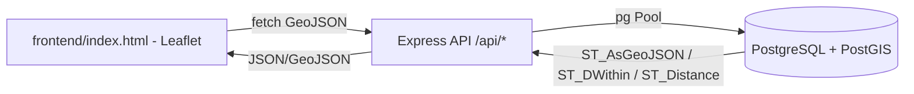
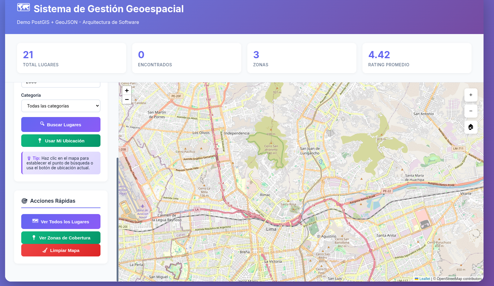

> [0. Acerca del Grupo](../../0.md) › [0.6. Temas Individuales (Parte 1)](../0.6.md) › [0.6.1. Integrante 1](0.6.1.md)

# 0.6.1. Integrante 1

# Manejo de Datos Geoespaciales
## PostGIS, GeoJSON, Node.js (Express) y Leaflet

# 1. Desarrollo Conceptual

## 1.1 ¿Qué son los Datos Geoespaciales?
Los datos geoespaciales describen objetos o fenómenos con ubicación en la Tierra. Combinan:
- Posición: coordenadas (latitud/longitud o X/Y).
- Atributos: propiedades descriptivas (nombre, categoría, etc.).
- Tiempo (opcional): cuándo suceden.

Habilitan análisis espaciales (distancias, contención, intersecciones) en Sistemas de Información Geográfica (GIS).

## 1.2 Tipos de Datos Geoespaciales
- **Vectorial**: entidades discretas.
  - Point: ubicación puntual (ej.: un restaurante).
  - LineString: secuencia de puntos conectados (ej.: una avenida).
  - Polygon: un área cerrada (ej.: zona de cobertura).
  - Colecciones: MultiPoint, MultiLineString, MultiPolygon, GeometryCollection.
- **Raster**: grillas de celdas (imágenes satelitales, DEM, temperatura). Cada píxel tiene un valor.

## 1.3 Sistemas de Referencia de Coordenadas (CRS)
- **Sistemas Geográficos** (angulares): WGS84 `EPSG:4326` (lat/lon), estándar global.
- **Sistemas Proyectados** (planos): UTM, Web Mercator `EPSG:3857` para mapas web.

Consideración: en geográficas (grados) las distancias/áreas se calculan sobre el elipsoide; en proyectadas se usan cálculos planos.

## 1.4 Geometría vs Geografía (en PostGIS)
- **geometry**: modelo plano; más rápido; ideal con proyecciones locales (p. ej., UTM) para performance.
- **geography**: modelo esférico; distancias/áreas en metros con mayor precisión global; más costo de cómputo.

En este proyecto se usa `GEOGRAPHY(..., 4326)` para puntos y polígonos, lo cual facilita consultas por radio en metros.

## 1.5 Operaciones Espaciales Fundamentales
- **Consulta**: `ST_Distance`, `ST_Area`, `ST_Length`, `ST_Centroid`.
- **Relación**: `ST_Contains`, `ST_Within`, `ST_Intersects`, `ST_Overlaps`, `ST_Touches`.
- **Transformación**: `ST_Buffer`, `ST_Union`, `ST_Intersection`, `ST_Difference`, `ST_Transform`.

## 1.6 Índices Espaciales
- **GiST (Generalized Search Tree)**: base de los índices espaciales en PostGIS.
- Beneficio: aceleran queries reduciendo escaneos completos a búsquedas logarítmicas.
- En el proyecto: índices GIST en `lugares.ubicacion` y `zonas_cobertura.geometria`.

## 1.7 Formatos de Intercambio
- **WKT/WKB**: texto/binario bien conocidos.
- **GeoJSON**: estándar web; `FeatureCollection` -> `features` con `geometry` y `properties`.

## 1.8 Patrones Arquitectónicos
- Arquitectura en capas: Presentación (Leaflet) → API (Express) → Lógica espacial (PostGIS) → Datos (PostgreSQL).
- Microservicios geoespaciales: geocodificación, ruteo, tiles, análisis, streaming.
- Tile servers: teselado XYZ, caché; no incluido en este proyecto, pero integrable.

---

# 2. Consideraciones Técnicas (Proyecto Actual)

## 2.1 Visión General del Proyecto
- **Repositorio**: raíz `tema-individual/`.
- **Componentes**:
  - Base de datos: `PostgreSQL + PostGIS` en Docker (`docker-compose.yml`).
  - Backend API: `Node.js + Express` en `backend/`.
  - Frontend: `Leaflet` en `frontend/index.html`, servido por el backend.
- **Flujo**: Frontend consume API REST → API ejecuta consultas espaciales en PostGIS → responde GeoJSON → Leaflet renderiza mapa y capas.

## 2.2 Puesta en Marcha (Local)
- Requisitos: Docker/Compose, Node.js >= 18.
- Paso 1: levantar la BD
```
docker-compose up -d
```
- Paso 2: verificar PostGIS
```
docker exec geospatial-db psql -U geouser -d geodata -c "SELECT PostGIS_Version();"
```
- Paso 3: instalar e iniciar backend
```
cd backend
npm install
npm start
```
- Acceso:
  - Frontend/API: `http://localhost:3002/` y `http://localhost:3002/api`.

## 2.3 Pruebas Rápidas
- Salud:
```
curl http://localhost:3002/api/health
```
- Categorías:
```
curl http://localhost:3002/api/categorias
```
- Lugares (GeoJSON):
```
curl http://localhost:3002/api/lugares
```
- Cercanos (2km desde Plaza Mayor):
```
curl "http://localhost:3002/api/lugares/cercanos?lat=-12.0464&lng=-77.0428&radius=2000"
```
- Crear lugar:
```
curl -X POST http://localhost:3002/api/lugares \
  -H "Content-Type: application/json" \
  -d '{
    "nombre":"Punto de prueba",
    "categoria":"Café",
    "lat":-12.05,
    "lng":-77.04,
    "rating":4.2
  }'
```
---

# 3. Implementación y Demostración

## 3.1 Estructura del Proyecto
```
.
├── docker-compose.yml
├── start.sh
├── database/
│   └── init.sql
├── backend/
│   ├── .env
│   ├── package.json
│   ├── server.js
│   ├── config/
│   │   └── database.js
│   └── routes/
│       ├── lugares.js
│       └── zonas.js
└── frontend/
    └── index.html
```

## 3.2 Consultas SQL de Ejemplo (PostGIS)
- Lugares por cercanía:
```
SELECT 
  l.nombre,
  c.nombre AS categoria,
  ROUND(ST_Distance(
    l.ubicacion,
    ST_GeogFromText('POINT(-77.0428 -12.0464)')
  )::numeric, 2) AS distancia_m
FROM lugares l
LEFT JOIN categorias c ON l.categoria_id = c.id
ORDER BY distancia_m
LIMIT 5;
```
- Lugares dentro de una zona específica:
```
SELECT l.*
FROM lugares l
WHERE ST_Within(
  l.ubicacion::geometry,
  (SELECT geometria::geometry FROM zonas_cobertura WHERE id = 1)
);
```
- Áreas de zonas (m²):
```
SELECT nombre, ROUND(ST_Area(geometria)::numeric, 2) AS area_m2
FROM zonas_cobertura;
```

---

# 4. Escalabilidad y Arquitectura

## 4.1 Estrategias de Escalamiento
- Vertical: ajustar `work_mem`, `maintenance_work_mem`, pooling de conexiones (`pgbouncer`).
- Horizontal: réplicas de lectura; partición por región; cache de consultas.

## 4.2 Diagrama de Flujo

---

# 5. Anexos

## 5.1 Comandos Útiles
- Ver versión PostGIS (contenedor):
```
docker exec geospatial-db psql -U geouser -d geodata -c "SELECT PostGIS_Version();"
```
- Logs del contenedor:
```
docker logs geospatial-db
```
- Backup/restore:
```
docker exec geospatial-db pg_dump -U geouser -d geodata > backup.sql
cat backup.sql | docker exec -i geospatial-db psql -U geouser -d geodata
```
- Servir un directorio simple (útil para pruebas):
```
python3 -m http.server 8080
```
---

# 6. Referencias
- PostGIS: https://postgis.net/documentation/
- PostgreSQL: https://www.postgresql.org/docs/
- RFC 7946 GeoJSON: https://datatracker.ietf.org/doc/html/rfc7946
- Leaflet: https://leafletjs.com/
- QGIS: https://qgis.org/


---



[🏠 Home](../../../README.md) | [Siguiente ➡️](../0.6.2/0.6.2.md)