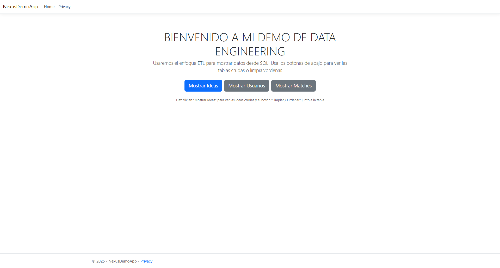

> [0. Acerca del Grupo](../../0.md) › [0.6. Temas Individuales (Parte 1)](../0.6.md) › [0.6.2. Integrante 2](0.6.2.md)

# 0.6.2. Integrante 2
# 🧠 DATA ENGINEERING — Proyecto: DATA ENGINEERING ETL  

## 📘 ¿Qué es Data Engineering?
La **Ingeniería de Datos** es el conjunto de prácticas que permiten **extraer, transformar y cargar (ETL)** información desde diversas fuentes para convertirla en datos estructurados, limpios y listos para análisis.  

En este proyecto, el proceso ETL se aplicó sobre archivos **CSV** que contienen datos de usuarios e ideas del sistema **Nexus**, para almacenarlos y transformarlos dentro de una base de datos SQL llamada **NexusDemo**.

---

## 🎯 Propósito del Proyecto
- Implementar un flujo **ETL completo** usando **SQL Server** y **Visual Studio**.  
- Cargar datos masivos desde archivos CSV, aplicando limpieza y validaciones.  
- Demostrar rendimiento, consistencia y trazabilidad en un entorno local.  
- Simular el trabajo de un ingeniero de datos al integrar múltiples fuentes en una base estructurada.  

---

## ⚙️ Componentes Clave del Proyecto

| Etapa | Descripción | Archivo / Herramienta |
|--------|--------------|-----------------------|
| **Extract (Extracción)** | Se obtienen los datos desde los archivos `Usuarios_Nexus500.csv` e `Ideas_Nexus500.csv`. | `ExtractCSV.sql` usando `BULK INSERT` |
| **Transform (Transformación)** | Limpieza de duplicados, estandarización de campos y validación de integridad. | `TransformANDLoad.sql` |
| **Load (Carga)** | Inserción final en la base de datos `NexusDemo` con relaciones y llaves primarias. | `DatosSQL.sql` + SSMS |
| **Validación** | Verificación de los datos cargados mediante consultas `SELECT` y medición de tiempos. | SQL Server Management Studio |

📊 **Resultado:** 500 usuarios y 500 ideas cargados en menos de 5 segundos.

---

## 🧩 Estructura del Repositorio

DATA-ENGINEERING-ETL/
├─ NexusData/ # Archivos CSV de entrada
│ ├─ Usuarios_Nexus500.csv
│ └─ Ideas_Nexus500.csv
│
├─ NexusDemoApp/ # Proyecto auxiliar .NET (gestión de conexión y vistas)
│ ├─ Controllers/
│ ├─ Models/
│ ├─ Services/
│ └─ Views/
│
├─ DatosSQL.sql # Creación de BD y tablas base
├─ ExtractCSV.sql # Carga inicial desde CSV
├─ TransformANDLoad.sql # Transformación y validación
├─ EXPOCISION_DATA_ENGINEERING.md
└─ README.md


---

## 🧠 Base de Datos — NexusDemo

| Tabla | Descripción |
|--------|--------------|
| **Usuarios** | Contiene ID, nombre, habilidad, reputación y fecha de registro. |
| **Ideas** | Contiene ID, título, categoría, creador y fecha de alta. |

🔹 Ambas tablas fueron diseñadas con claves primarias (`PK_Usuarios`, `PK_Ideas`) y tipos de datos `NVARCHAR` para flexibilidad.  

📄 **Ejemplo de definición:**
```sql
CREATE TABLE dbo.Usuarios (
    IdUsuario INT IDENTITY(1,1) PRIMARY KEY,
    Nombre NVARCHAR(100) NOT NULL,
    Skill NVARCHAR(100) NOT NULL,
    Reputacion INT,
    FechaAlta DATETIME2 DEFAULT SYSDATETIME()
);

🧰 Herramientas Utilizadas
Herramienta	Rol
SQL Server 2022	Motor de base de datos para carga, transformación y consultas.
Visual Studio 2022 (.NET 8)	Ejecución y conexión de la app auxiliar NexusDemoApp.
CSV Data Source	Datos de entrada para usuarios e ideas (generados y transformados).
GitHub	Control de versiones y publicación del proyecto.

🧪 Ejemplo de Flujo ETL

Crear la base de datos y tablas:

:r DatosSQL.sql

Cargar los CSV:

:r ExtractCSV.sql


Transformar y limpiar los datos:

:r TransformANDLoad.sql


Validar los resultados:

SELECT COUNT(*) FROM Usuarios;
SELECT COUNT(*) FROM Ideas;


🖼️ **Evidencias visuales: **

| | |
|:--:|:--:|
|  |  |
| *Datos Ideas CSV* | *Home* |
|  |  |
| *Query Ideas* | *SQL Transform & Load* |
|  |  |
| *Tabla cruda (Raw Data)* | *Tabla limpia (Datos cargados)* |


🧾 **Resultados y Métricas**

| Indicador | Resultado |
|:-----------|:-----------:|
| Usuarios cargados | **500** |
| Ideas cargadas | **500** |
| Tiempo total de carga | **< 5 segundos** |
| Errores encontrados | **0** |
| Conexión a BD | **Estable y persistente** |


✅ **Conclusión del Proceso**

Se logró una **carga masiva eficiente** con validación automática y mínima intervención manual.

---

🧱 **Buenas Prácticas Aplicadas**

- 🧩 **Separación por fases:** uso de scripts diferenciados para **creación**, **extracción** y **transformación**.
- ⚙️ **Rutas parametrizadas:** evitan dependencias de entornos locales y facilitan la portabilidad.
- 🧼 **Limpieza previa de datos:** eliminación de **valores NULL** y **duplicados** antes de la carga final.
- 🧠 **Estructura modular:** permite **escalar y mantener** el flujo ETL de forma sencilla.
- 🗂️ **Control de versiones:** integración continua del proyecto mediante **GitHub**.

---

📊 Estos lineamientos aseguran un proceso **robusto, trazable y reproducible**, cumpliendo con los estándares de **Data Engineering profesional**.

🧩 **DEMO**

Este proyecto corresponde a la **Demo final del módulo de Data Engineering**, y presenta el **funcionamiento completo del proceso ETL** implementado en entorno local.

---

🚀 **Ejecución del flujo**

1. 🗄️ **Configurar** la base de datos `NexusDemo` en **SQL Server**.  
2. 💾 **Ejecutar** los tres scripts en orden:  
   - `DatosSQL.sql`  
   - `ExtractCSV.sql`  
   - `TransformANDLoad.sql`
3. 🔍 **Validar** la carga mediante consultas SQL y visualización desde la app **.NET**.  
4. ⏱️ **Confirmar** los tiempos y resultados en la consola de SQL Server.  

---

📽️ **Evidencia en video**

El video de demostración muestra la ejecución **paso a paso** en **Visual Studio** y **SSMS**, verificando la correcta integración entre los componentes.

---

🙌 **Conclusión**

El proyecto **DATA ENGINEERING ETL** demuestra cómo construir un flujo **ETL funcional y modular** usando herramientas accesibles:

- 🧠 **SQL Server** → Procesamiento y almacenamiento de datos.  
- 💻 **Visual Studio (.NET)** → Integración e interfaz de ejecución.  
- 📊 **CSV** → Fuente externa simulando datos reales.

✅ Se cumplieron los objetivos de **rendimiento, fiabilidad y trazabilidad**, consolidando una base sólida para futuras **capas analíticas o dashboards de BI**.


🔗 Repositorio Público

👉 https://github.com/IMANOL-bot/DATA-ENGINEERING-ETL

👨‍💻 Autor:
Imanol Castro Gutiérrez
Universidad de Lima — Arquitectura de Software (2025)


[⬅️ Anterior](../0.6.1/0.6.1.md) | [🏠 Home](../../../README.md) | [Siguiente ➡️](../0.6.3/0.6.3.md)