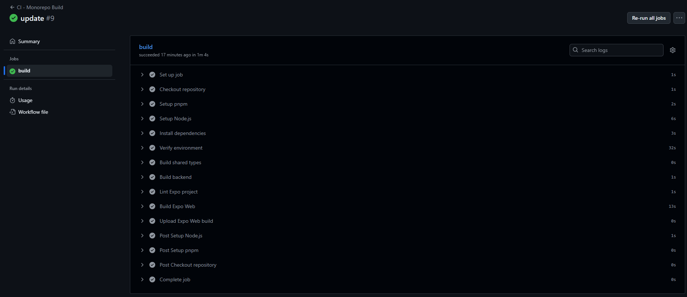

> [0. Acerca del Grupo](../../0.md) › [0.6. Temas Individuales (Parte 1)](../0.6.md) › [0.6.4. Integrante 4](0.6.4.md)

# 0.6.4. Integrante 4

# 🧩 Monorepo

## 📘 ¿Qué es un Monorepo?

Un **Monorepo** es un sistema de organización donde un único repositorio contiene **múltiples proyectos**.
Esto **no es lo mismo** que un monolito.

> **MONOREPO ≠ MONOLITO**

---

## ⚙️ Comparativa: Monorepo vs Monolito

| Aspecto           | Monorepo                                      | Monolito                               |
| ----------------- | --------------------------------------------- | -------------------------------------- |
| **Código**        | Un repositorio con muchos proyectos separados | Un solo proyecto grande                |
| **Escalabilidad** | Fácil agregar nuevos módulos                  | Difícil crecer sin volverlo complejo   |
| **Despliegue**    | Se puede desplegar por partes                 | Siempre se despliega todo              |
| **Mantenimiento** | Flexible, pero requiere organización          | Simple al inicio, pesado con el tiempo |

---

## 🧠 ¿Por qué usar un Monorepo?

- Permite **compartir dependencias de forma centralizada**.
- Permite hacer **modificaciones que abarcan múltiples módulos** con un solo _commit_.
- Todos los equipos pueden **ver el código de otros módulos**, lo que mejora la colaboración.
- Se pueden imponer **reglas comunes** (lint, pruebas, build) en todo el repositorio.

---

## ✅ Cuándo conviene usar un Monorepo

- Varias apps o servicios que **comparten código** (por ejemplo: frontend, backend y mobile con la misma librería).
- **Microservicios** que deben mantenerse alineados.
- Un solo equipo o empresa que **mantiene varios proyectos relacionados**.

---

## ❌ Cuándo _no_ conviene usar un Monorepo

- Proyectos **pequeños e independientes** que no comparten nada.
- Equipos **poco coordinados**, lo que genera conflictos al trabajar en un repositorio grande.
- Proyectos con **dependencias muy diferentes** (por ejemplo: Node.js + Java + Python en el mismo repo).

---

## ⚠️ Desventajas del Monorepo

- **Escalabilidad del repositorio**: a medida que crece, puede volverse pesado.
- **Operaciones de Git lentas** (clone, fetch, history).
- **Conflictos de ramas y merges** con muchos equipos trabajando simultáneamente.
- Requiere **disciplina en la gestión de versiones**.
- **Sobrecarga** en procesos de build y pruebas.

---

## 🧰 Herramientas para la organización de un Monorepo

| Herramienta   | Descripción                                                                                | Desarrollador |
| ------------- | ------------------------------------------------------------------------------------------ | ------------- |
| **Bazel**     | Compila y prueba proyectos grandes en distintos lenguajes.                                 | Google        |
| **Turborepo** | Ejecuta tareas (build, test, lint) rápido y en paralelo dentro de monorepos web.           | Vercel        |
| **Gradle**    | Organiza paquetes, dependencias y flujos de trabajo en monorepos de JavaScript/TypeScript. | Gradle, Inc   |
| **Rush**      | Sistema de gestión para grandes monorepos de Microsoft.                                    | Microsoft     |
| **Nx**        | Framework para organizar y automatizar monorepos de JavaScript/TypeScript.                 | Nx Team       |
| **Moonrepo**  | Administra tareas y dependencias en monorepos modernos.                                    | Moonrepo      |
| **Pants**     | Sistema para builds escalables en Python, Go y otros lenguajes.                            | Pants Build   |

---

## 🙌 Conclusión

El uso de un **Monorepo** facilita la colaboración, el mantenimiento y la consistencia entre proyectos.
Sin embargo, requiere una buena organización y herramientas adecuadas para evitar la complejidad a gran escala.

---

## DEMO

Este documento describe la implementación de un **Monorepo** que se va utilizar para desarollar el proyecto **Nexus**
Integra:

- Aplicación móvil y web multiplataforma con **Expo / React Native** (`apps/mobile`)
- Backend con **NestJS** (`apps/backend`)
- Paquetes compartidos de TypeScript (`packages/types`)
- Gestión de dependencias y scripts con **pnpm**
- Orquestación de builds y cache con **Turborepo**
- CI/CD con **GitHub Actions**

---

## Estructura del Monorepo

```text
NexusMonorepo/
├─ apps/
│  ├─ backend/           # NestJS backend
│  └─ mobile/            # Expo app (iOS, Android, Web)
├─ packages/
│  └─ types/             # Tipos compartidos TS
├─ turbo.json             # Configuración de Turborepo
├─ package.json           # Scripts y dependencias raíz
├─ pnpm-workspace.yaml    # Workspace pnpm
└─ .github/
   └─ workflows/
      └─ ci.yml           # Pipeline de CI/CD
```

---

## 1. Configuración de `pnpm`

Archivo `pnpm-workspace.yaml`:

```yaml
packages:
  - "apps/*"
  - "packages/*"
```

Instalación de dependencias en la raíz:

```bash
pnpm install
> Nota: Todas las apps y paquetes comparten `node_modules` en la raíz.
```

---

## 2. Configuración de Turborepo

Archivo `turbo.json`:

```json
{
  "$schema": "https://turbo.build/schema.json",
  "pipeline": {
    "build": {
      "dependsOn": ["^build"],
      "outputs": ["dist/**", "build/**"]
    },
    "expo-build": {
      "dependsOn": ["^build"],
      "outputs": ["apps/mobile/web/**"]
    },
    "dev": {
      "cache": false
    }
  }
}
```

### Explicación:

- `build`: Construye todos los paquetes dependientes (`types`, `backend`) antes de cualquier build.
- `expo-build`: Ejecuta `expo export -p web` en `apps/mobile` y cachea la carpeta final `web`.
- `dev`: Tareas de desarrollo, sin cache.

---

## 3. Configuración de la app móvil (`apps/mobile/package.json`)

```json
{
  "name": "mobile",
  "version": "1.0.0",
  "private": true,
  "scripts": {
    "dev": "expo start",
    "android": "expo run:android",
    "ios": "expo run:ios",
    "web": "expo start --web",
    "lint": "expo lint",
    "expo-build": "npx expo export -p web"
  },
  "dependencies": {
    "expo": "^54.0.0",
    "react": "19.1.0",
    "react-dom": "19.1.0",
    "react-native": "0.76.0",
    "react-native-web": "^0.21.0"
  }
}
```

---

## 4. Backend (`apps/backend`)

- Proyecto NestJS estándar
- Script de build:

```json
"scripts": {
  "build": "nest build"
}
```

---

## 5. Paquetes compartidos (`packages/types`)

- Contiene tipos TypeScript compartidos entre backend y mobile
- Script de build:

```json
"scripts": {
  "build": "tsc -p tsconfig.build.json"
}
```

- Turbo cachea la salida en `dist/**`.

---

## 6. GitHub Actions: CI/CD

Archivo `.github/workflows/ci.yml`:

```yaml
name: CI - Monorepo Build

on:
  push:
    branches: [main]
  pull_request:
    branches: [main]

jobs:
  build:
    runs-on: ubuntu-latest

    steps:
      - name: Checkout repository
        uses: actions/checkout@v4

      - name: Setup pnpm
        uses: pnpm/action-setup@v4
        with:
          version: 10.18.0
          run_install: false

      - name: Setup Node.js
        uses: actions/setup-node@v4
        with:
          node-version: 20
          cache: "pnpm"

      - name: Install dependencies
        run: pnpm install --frozen-lockfile

      - name: Verify environment
        run: |
          node -v
          pnpm -v
          pnpm turbo --version
          npx expo --version

      - name: Build shared types
        run: pnpm turbo run build --filter=@myrepo/types

      - name: Build backend
        run: pnpm turbo run build --filter=backend

      - name: Lint Expo project
        run: pnpm --filter=mobile run lint

      - name: Build Expo Web
        run: pnpm --filter=mobile run expo-build

      - name: Upload Expo Web build
        if: success()
        uses: actions/upload-artifact@v4
        with:
          name: expo-web
          path: apps/mobile/web
```

### Detalles:

- Usa **pnpm + Node 20 + Turborepo**.
- Compila primero `types` y `backend`.
- Luego ejecuta `expo export -p web`.
- Subida de artefactos a GitHub Actions (`apps/mobile/web`).

---

## 8. Ejecución local

1. Build de todo el monorepo:

```bash
pnpm turbo run build
```

2. Build de la web:

```bash
pnpm turbo run expo-build
```

3. Ejecutar Expo en modo desarrollo web:

```bash
pnpm --filter mobile run web
```

---

## Resultados

### Ejecucion del workflow build



### Visualizacion Pagina web inicial Nexus


### Visualizacion App movil inicial Nexus


[⬅️ Anterior](../0.6.3/0.6.3.md) | [🏠 Home](../../../README.md) | [Siguiente ➡️](../0.6.5/0.6.5.md)