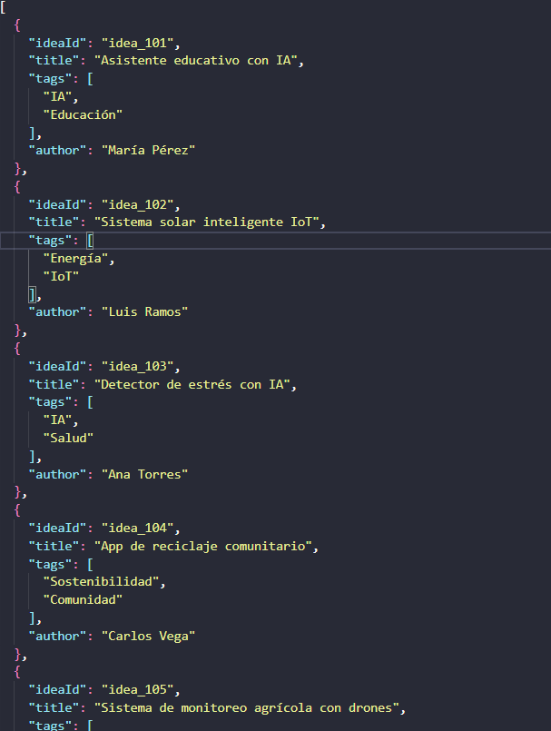
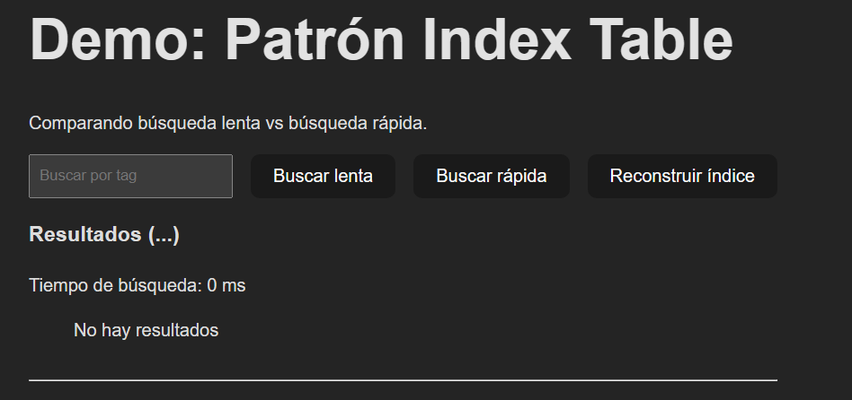
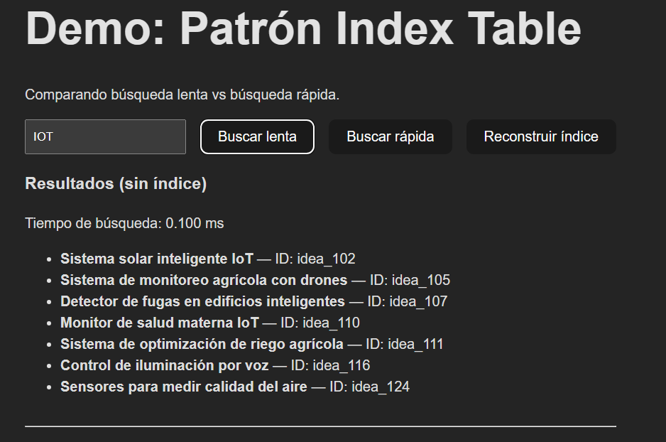
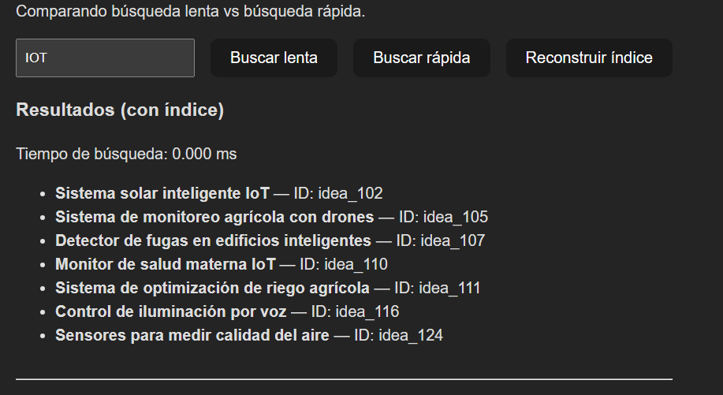

> [0. Acerca del Grupo](../../0.md) › [0.7. Trabajo Individual (Patrones Cloud)](../0.7.md) › [0.7.4. Integrante 4](0.7.4.md)

# 0.7.4. Integrante 4

# Index Table Pattern

## Problema
En muchas bases de datos NoSQL solo puedes buscar datos rápidamente si conoces la clave primaria. Consultar por otros campos requiere escanear todos los registros, lo cual es muy lento.

## Solución
Crear manualmente Index Tables que organicen los datos por claves secundarias. 
Existen **3 estrategias**:

### 1. **Duplicación Completa**
- Copia todos los datos en cada Index Table, organizados por diferentes claves
- **Ventaja**: Consulta rápida con una sola búsqueda
- **Desventaja**: Alto consumo de espacio y mantenimiento costoso

### 2. **Normalización Completa**
- La Index Table solo guarda la clave secundaria y una referencia a la clave primaria
- **Ventaja**: Ahorra espacio
- **Desventaja**: Requiere dos consultas (primero el índice, luego la tabla principal)

### 3. **Normalización Parcial** (recomendada)
- Duplica solo los campos consultados frecuentemente
- Mantiene referencias para campos menos usados
- **Equilibrio** entre velocidad y espacio

## Características Avanzadas

- **Claves compuestas**: Concatenar múltiples campos (ej: Ciudad+Apellido)
- **Datos fragmentados**: Útil cuando la clave primaria está hasheada, evita recalcular hashes

## Cuándo Usar

**SÍ usar cuando:**
- Se consulta frecuentemente por campos que no son la clave primaria
- Los datos son relativamente estáticos

**NO usar cuando:**
- Datos muy volátiles (el índice queda obsoleto rápidamente)
- Campos con pocos valores distintos (ej: género)
- Distribución muy sesgada (90% de registros con el mismo valor)

# DEMO Index Table

Comparacion de la mejora en tiempo por usar Index Table Pattern

### Previsualizacion de Datos extraidos de una base de datos NOSQL

### Creacion del Index
- Lee todas las ideas.
- Agrupa sus IDs y títulos según cada tag.
- Guarda el resultado en un nuevo archivo JSON (ideaTagIndex.json).
```
const buildIndexTable = () => {
    const newIndex = {};
    for (const idea of ideas) {
      for (const tag of idea.tags) {
        const normalizedTag = tag.toLowerCase();
        if (!newIndex[normalizedTag]) newIndex[normalizedTag] = [];
        newIndex[normalizedTag].push({ ideaId: idea.ideaId, title: idea.title });
      }
    }
    localStorage.setItem("ideaTagIndex", JSON.stringify(newIndex));
    setIndexTable(newIndex);
    alert("Índice reconstruido");
  };
```
#### Resultado
```
{
  "IA": [
    { "ideaId": "idea_101", "title": "Asistente educativo con IA" },
    { "ideaId": "idea_103", "title": "Detector de estrés con IA" }
  ],
  "Educación": [
    { "ideaId": "idea_101", "title": "Asistente educativo con IA" }
  ]
}
```
### Funciones para la busqueda
```
const searchSlow = () => {
    const start = performance.now();
    const filtered = ideas.filter((idea) =>
      idea.tags.some((tag) => tag.toLowerCase().includes(query.toLowerCase()))
    );
    const end = performance.now();
    setResults(filtered);
    setMode("slow");
    setSearchTime((end - start).toFixed(3));
  };

  const searchFast = () => {
    const start = performance.now();
    const idx = indexTable[query.toLowerCase()] || [];
    const end = performance.now();
    setResults(idx);
    setMode("fast");
    setSearchTime((end - start).toFixed(3));
  };


```
### Comparacion

#### Buscamos por Tag "IOT"


Presionamos boton reconstruir indice

El tiempo de ejecución de la búsqueda rápida es extremadamente corto (menor a 1 milisegundo) por lo que no se ve exactamente y confirma la mejora al integrar este patron

[Demo](./ITDEMO/)


---

[⬅️ Anterior](../0.7.3/0.7.3.md) | [🏠 Home](../../../README.md) | [Siguiente ➡️](../0.7.5/0.7.5.md)