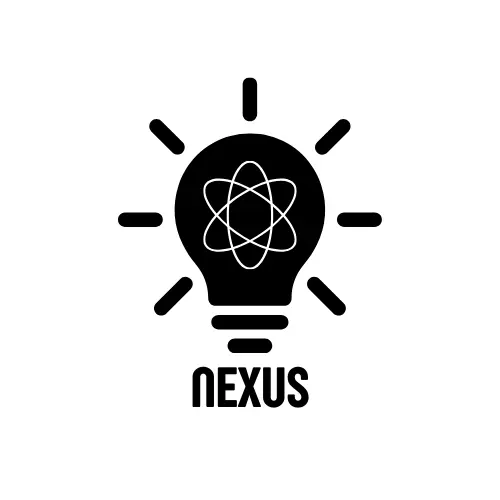

# 1.1. Generalidades

### Información General

**Nombre de la app**: **NEXUS**

**Descripción**:
**NEXUS** es una aplicación móvil y web que funciona como un **repositorio colaborativo de ideas**. Su objetivo es conectar a personas que tienen ideas innovadoras pero carecen de conocimientos especificos o recursos técnicos para desarrollarlas, con profesionales, estudiantes y emprendedores que sí cuentan con las habilidades necesarias para materializarlas en prototipos o productos reales.

La plataforma permite que los usuarios publiquen sus ideas de forma estructurada, incluyendo descripciones, problemas que resuelven y posibles beneficios. Otros usuarios con habilidades específicas (programadores, diseñadores, ingenieros, makers, etc.) pueden postularse para colaborar, ofrecer prototipos o incluso comercializar el proyecto en conjunto.

Asimismo, **NEXUS** incluye un sistema de **recompensas y pagos**:

* Los creadores de ideas pueden ofrecer pagos a quienes desarrollen un prototipo funcional.
* También puede existir un sistema de co-creación en el que se acuerde un porcentaje de participación en caso de que el proyecto tenga éxito.
* Para proyectos colaborativos no comerciales, la plataforma otorga reconocimiento y reputación digital a los participantes.

Con esta app, las buenas ideas dejan de quedarse en papel o en la mente de alguien y se convierten en proyectos viables mediante la colaboración entre la comunidad.

- - -

**Problemática identificada**:
Cada día surgen miles de ideas innovadoras, pero la mayoría nunca llega a ejecutarse debido a:

* La falta de conocimientos técnicos de quienes las conciben.
* La ausencia de espacios accesibles para conectar creadores de ideas con desarrolladores o makers.
* La desconfianza en compartir ideas sin garantías de reconocimiento o compensación.

Al mismo tiempo, hay muchas personas con talento y habilidades técnicas que buscan proyectos para aplicar sus capacidades, pero carecen de inspiración o contactos.

Esto genera una **brecha de innovación**: ideas que nunca se desarrollan y talentos que nunca encuentran un reto adecuado.
- - -
# Módulos
---

## Módulo 1: Gestión de Usuarios y Perfiles

Este módulo permite a los usuarios crear, personalizar y administrar sus perfiles dentro de Nexus. Incluye el registro , inicio de sesión, recuperación de credenciales y configuración de datos personales o académicos. Además, cada perfil refleja las habilidades, intereses e historial de participación del usuario en proyectos e ideas.

---

## Módulo 2: Publicación y Búsqueda de Ideas

En este módulo los usuarios pueden publicar nuevas ideas o proyectos y ponerlas a disposición de la comunidad. También incorpora un motor de búsqueda y filtros que permiten encontrar iniciativas por categorías, palabras clave o áreas de interés

---

## Módulo 3: Colaboración y Comunicación

Este módulo proporciona las herramientas para que los usuarios interactúen y trabajen en conjunto. Incluye dm,  y espacios compartidos para coordinar avances de proyectos. Su propósito es fomentar la colaboración, el intercambio de conocimientos y la construcción de soluciones

---

## Módulo 4: Pagos y Recompensas

Aquí se gestionan las transacciones relacionadas con la participación en Nexus. Los usuarios pueden recibir recompensas por aportes en proyectos. El módulo integra pasarelas de pago para administrar transferencias

---

## Módulo 5: Monetización e Ingresos para NEXUS

Este módulo está orientado a la sostenibilidad de la plataforma. Define los mecanismos mediante los cuales Nexus genera ingresos, como comisiones por transacciones, planes premium, etc. Además, establece políticas de distribución de ingresos y reglas de monetización
