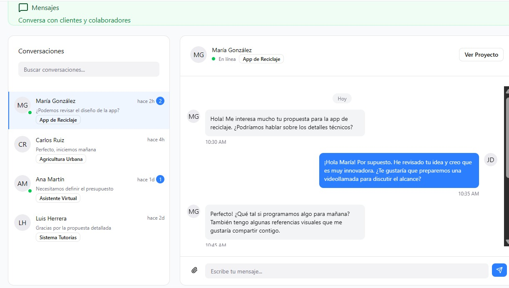

# 2.1.2. Módulo 2

## Módulo 2: Colaboración de Ideas

### MockUp hecho en Figma

## 📋 Listado de Historias de Usuario
| ID | Nombre | Historia de Usuario |
|:--|:--|:--|
| **HU013** | Ver proyectos y canales de colaboración | Como usuario registrado, quiero visualizar los proyectos en los que participo o puedo colaborar, para unirme a sus canales de comunicación internos. |
| **HU014** | Filtrar proyectos activos por afinidad | Como usuario, quiero aplicar filtros por categoría o tecnología para encontrar equipos activos donde pueda integrarme y comunicarme. |
| **HU015** | Enviar solicitud de colaboración | Como usuario interesado, quiero postularme a un proyecto enviando una solicitud para unirme a su equipo de trabajo. |
| **HU016** | Adjuntar portafolio o perfil técnico | Como usuario postulante, quiero adjuntar un resumen de mi experiencia o portafolio para respaldar mi solicitud. |
| **HU017** | Aceptar o rechazar solicitudes de colaboración | Como creador del proyecto, quiero revisar y aceptar o rechazar solicitudes para conformar un equipo adecuado. |
| **HU018** | Notificar respuesta de solicitud | Como usuario postulante, quiero recibir una notificación cuando mi solicitud sea aceptada o rechazada para conocer mi estado. |
| **HU019** | Enviar y recibir mensajes dentro del proyecto | Como miembro del equipo, quiero disponer de un chat interno en cada proyecto para coordinar tareas y compartir información. |
| **HU020** | Crear grupos de conversación por rol o tarea | Como colaborador, quiero crear subchats según rol o tipo de tarea (diseño, desarrollo, testing, etc.) para mantener una comunicación organizada. |
| **HU021** | Compartir archivos y enlaces | Como miembro del equipo, quiero poder enviar archivos o enlaces dentro del chat del proyecto para facilitar la colaboración. |
| **HU022** | Gestionar participantes activos | Como creador o líder del proyecto, quiero visualizar y administrar la lista de miembros activos en la colaboración. |
| **HU023** | Salir de un proyecto | Como colaborador, quiero poder abandonar un proyecto en cualquier momento sin afectar la continuidad del equipo. |
| **HU024** | Calificar y comentar la experiencia de colaboración | Como participante, quiero evaluar la colaboración al finalizar el proyecto para fortalecer la reputación y confianza entre miembros. |

### Listado de Requisitos funcionales principales

| ID | Nombre | Descripción |
| - | - | - |
| **RF010** | **Autenticación y Registro** | Permitir registro mediante correo electrónico, autenticación JWT y recuperación de contraseña segura. |
| **RF011** | **Gestión de Perfil de Usuario** | Permitir editar nombre, foto, biografía, habilidades e intereses, con validaciones y privacidad configurable. |
| **RF012** | **Gestión de Roles** | Implementar roles de usuario (Administrador, Colaborador, Visitante) con permisos diferenciados. |
| **RF013** | **Notificaciones en Tiempo Real** | Enviar notificaciones mediante WebSocket ante invitaciones, comentarios o cambios de estado. |
| **RF014** | **Mensajería Directa** | Habilitar chat privado entre colaboradores vinculados a una misma idea, con historial persistente. |
| **RF015** | **Subchats por Tema** | Permitir la creación de subchats temáticos dentro de una idea para segmentar conversaciones. |
| **RF016** | **Indicadores de Conexión** | Mostrar estado de conexión (en línea / escribiendo / desconectado) en tiempo real mediante Socket.IO. |
| **RF017** | **Sincronización Colaborativa** | Mantener sincronización en vivo de mensajes y actualizaciones entre múltiples usuarios. |
| **RF018** | **Autoguardado Local** | Guardar temporalmente mensajes o ediciones en caso de desconexión, reintentando al reconectarse. |
| **RF019** | **Historial de Mensajes** | Guardar y visualizar mensajes anteriores ordenados cronológicamente, con paginación. |
| **RF020** | **Moderación de Contenido** | Permitir a los autores reportar o eliminar mensajes inapropiados y registrar eventos de moderación. |