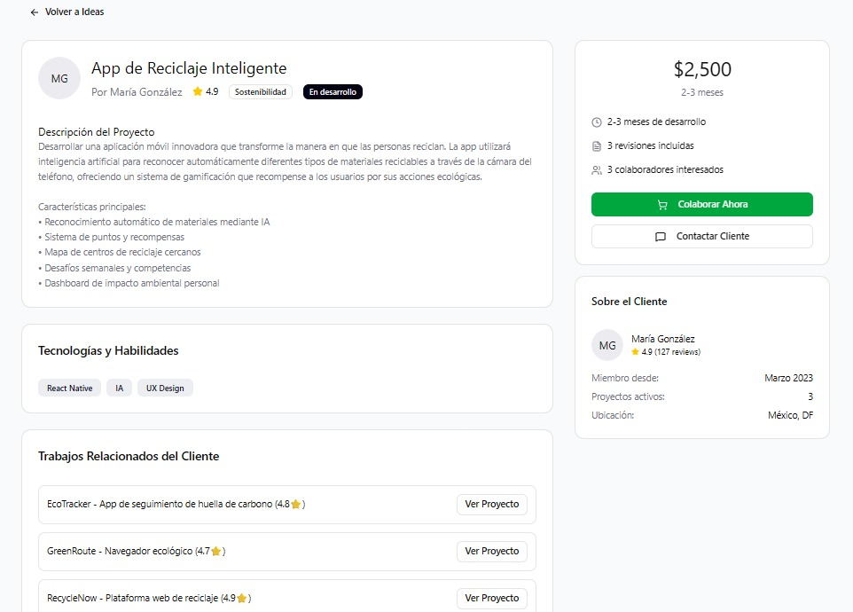

# 2.1.2. Módulo 2

## Módulo 2: Publicación de Ideas

### MockUp hecho en Figma

### Listado de Historias de Usuario

| ID | Nombre | Historia de Usuario |
|-|-|-|
| **HU001** | **Crear nueva idea** | **Como** usuario registrado, **quiero** poder crear una nueva publicación de idea **para** compartir mi concepto innovador con la comunidad |
| **HU002** | **Definir título descriptivo** | **Como** creador de ideas, **quiero** asignar un título claro y atractivo a mi proyecto **para** que otros usuarios comprendan rápidamente de qué se trata |
| **HU003** | **Escribir descripción detallada** | **Como** usuario con una idea, **quiero** escribir una descripción completa del proyecto **para** explicar el problema que resuelve y cómo funciona |
| **HU004** | **Seleccionar categoría** | **Como** publicador, **quiero** clasificar mi idea en una categoría específica (Sostenibilidad, Tecnología, etc.) **para** que sea más fácil de encontrar |
| **HU005** | **Definir presupuesto/recompensa** | **Como** creador de ideas, **quiero** establecer un monto de recompensa **para** incentivar a desarrolladores a colaborar en mi proyecto |
| **HU006** | **Establecer tiempo de desarrollo** | **Como** usuario, **quiero** definir un plazo estimado **para** que los colaboradores conozcan las expectativas temporales |
| **HU007** | **Especificar tecnologías requeridas** | **Como** creador, **quiero** indicar las tecnologías necesarias **para** atraer profesionales con las habilidades adecuadas |
| **HU008** | **Agregar etiquetas** | **Como** usuario, **quiero** añadir etiquetas relevantes a mi idea **para** mejorar su visibilidad en las búsquedas |
| **HU009** | **Vista previa antes de publicar** | **Como** creador, **quiero** ver una vista previa de cómo se verá mi publicación **para** verificar que toda la información esté correcta |
| **HU010** | **Publicar idea** | **Como** usuario, **quiero** publicar mi idea en la plataforma **para** que esté disponible para la comunidad de colaboradores |
| **HU011** | **Guardar borrador** | **Como** creador, **quiero** guardar mi idea como borrador **para** poder editarla más tarde antes de publicarla |
| **HU012** | **Editar idea publicada** | **Como** autor de una idea, **quiero** poder editar mi publicación **para** actualizar información o corregir errores |

### Listado de Requisitos funcionales principales

|ID|Nombre|Descripción|
|-|-|-|
| **RF001** | **Gestión de Publicaciones** | El sistema debe permitir a los usuarios registrados crear, editar, eliminar y publicar ideas de manera controlada. Cada publicación debe contar con validación de campos obligatorios, generación de ID único y trazabilidad de cambios. |
| **RF002** | **Formulario de Creación** | El sistema debe proporcionar un formulario estructurado con campos específicos para título (máximo 100 caracteres), descripción con texto enriquecido, categoría, presupuesto, tiempo estimado y tecnologías requeridas. Debe incluir validaciones de formato, longitud y tipo de datos para garantizar la calidad de la información publicada. |
| **RF003** | **Sistema de Categorización** | El sistema debe mantener un catálogo predefinido y actualizable de categorías (Sostenibilidad, Tecnología, Salud, etc.) permitiendo a los usuarios clasificar sus ideas en una categoría principal para facilitar la organización y búsqueda posterior de proyectos afines. |
| **RF004** | **Gestión de Presupuesto/Recompensas** | El sistema debe permitir la definición de montos de recompensa con validación numérica, visualización en la moneda del usuario y verificación de valores mayores a $0. Debe incluir la opción de marcar proyectos como colaboración sin compensación económica para fomentar diferentes tipos de participación. |
| **RF005** | **Gestión Temporal** | El sistema debe ofrecer opciones predefinidas de duración (1 mes, 2-3 meses, 6 meses, 1 año, flexible) y permitir fechas personalizadas, calculando automáticamente la fecha estimada de finalización para brindar claridad temporal a los potenciales colaboradores sobre las expectativas del proyecto. |
| **RF006** | **Sistema de Tecnologías/Habilidades** | El sistema debe mantener un catálogo organizado de tecnologías y habilidades categorizadas por tipo, permitiendo selección múltiple y la adición de tecnologías personalizadas para garantizar matches precisos entre ideas y desarrolladores especializados. |
| **RF007** | **Sistema de Etiquetas** | El sistema debe permitir agregar hasta 10 etiquetas por idea con sugerencias automáticas basadas en popularidad, validación de caracteres especiales y normalización a minúsculas para mantener consistencia en el sistema de búsqueda y clasificación de contenido. |
| **RF008** | **Vista Previa y Validación** | El sistema debe generar una vista previa exacta de la publicación antes de confirmarla, incluyendo validación integral de todos los campos, visualización de errores específicos y navegación fluida entre edición y previsualización para asegurar la calidad de las publicaciones. |
| **RF009** | **Gestión de Borradores** | El sistema debe implementar autoguardado cada 30 segundos y guardado manual de borradores, con una interfaz para gestionar, editar y eliminar borradores desde el perfil del usuario, permitiendo trabajo iterativo en las ideas antes de su publicación final. |
| **RF010** | **Control de Estados** | El sistema debe manejar el ciclo de vida completo de las ideas mediante estados definidos (Borrador, Publicada, En desarrollo, Pausada, Completada) con permisos restringidos al autor, registro de historial de cambios y notificaciones automáticas a colaboradores interesados. |
| **RF011** | **Permisos y Seguridad** | El sistema debe implementar verificación de autenticación robusta, asociación de ideas con usuarios creadores, control de permisos de edición exclusivo para autores originales y filtros automáticos de contenido inapropiado para mantener la integridad y seguridad de la plataforma. |
