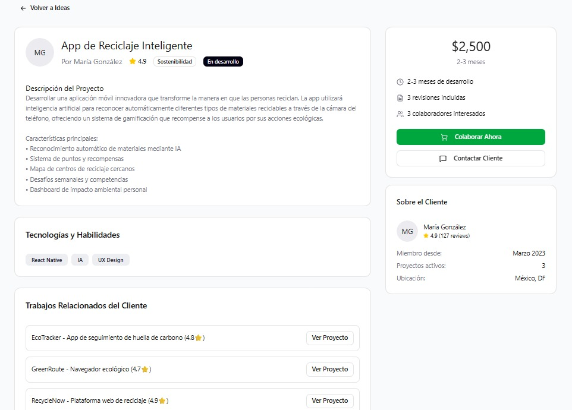

> [2. Requisitos del Sistema](../2.md) › [2.1. Requisitos Funcionales](2.1.md)

# 2.1.6. Listado Consolidado de Requisitos Funcionales

## Módulo 1: Búsqueda de ideas

En este módulo se incorpora un motor de búsqueda y filtros que permiten encontrar iniciativas por categorías, palabras clave o áreas de interés

---

## Módulo 2: Colaboración y Comunicación

Este módulo proporciona las herramientas como Dm chat para que los usuarios interactúen y trabajen en conjunto. 

---

## Módulo 3: Pagos o Recompensas

Los usuarios pueden recibir recompensas por aportes en proyectos. El módulo integra pasarelas de pago para administrar transferencias y comisiones.

---

## Módulo 4: Publicación de Ideas

En este módulo los usuarios pueden publicar nuevas ideas o proyectos y ponerlas a disposición de la comunidad. 
### Publicacion de idea

### Formulario para la creacion de una idea

---

## Módulo 5: Gestión de Perfil

Este módulo permite a los usuarios crear, personalizar y administrar sus perfiles dentro de Nexus. Incluye el registro , inicio de sesión, recuperación de credenciales y configuración de datos personales o académicos. Además, cada perfil refleja las habilidades, intereses e historial de participación del usuario en proyectos e ideas.

---
| ID | Nombre | Descripción |
| - | - | - |
| **RF001** | **Búsqueda por palabra clave** | Permitir buscar por `q` en título y descripción, devolviendo resultados por relevancia con p95 ≤ 1s (10k ideas). |
| **RF002** | **Filtros** | Filtros combinables por `categoría`, `tags[]`, `habilidades[]`, `estado`, `fecha`, `popularidad`. |
| **RF003** | **Ordenamiento** | Orden por relevancia (default), fecha (desc) y popularidad (desc) con estabilidad ante empates. |
| **RF004** | **Paginación** | Soporte para `page` y `pageSize` (10–50), devolviendo `total`, `page`, `pageSize` y elementos correctos. |
| **RF005** | **Autocompletado** | Endpoint de sugerencias a partir de texto parcial con p95 ≤ 150ms, evitando duplicados. |
| **RF006** | **Búsquedas guardadas** | Guardar, listar y ejecutar búsquedas propias con límite por usuario. |
| **RF007** | **Visibilidad** | Aplicar visibilidad pública, privada o compartida a las consultas y resultados. |
| **RF008** | **Facetas dinámicas** | Mostrar conteos por categoría, tags y habilidades según filtros activos. |
| **RF009** | **Telemetría de búsqueda** | Registrar métricas `search_performed`, `result_click`, latencia y errores. |
| **RF010** | **Autenticación y Registro** | Permitir registro mediante correo electrónico, autenticación JWT y recuperación de contraseña segura. |
| **RF011** | **Gestión de Perfil de Usuario** | Permitir editar nombre, foto, biografía, habilidades e intereses, con validaciones y privacidad configurable. |
| **RF012** | **Gestión de Roles** | Implementar roles de usuario (Administrador, Colaborador, Visitante) con permisos diferenciados. |
| **RF013** | **Notificaciones en Tiempo Real** | Enviar notificaciones mediante WebSocket ante invitaciones, comentarios o cambios de estado. |
| **RF014** | **Mensajería Directa** | Habilitar chat privado entre colaboradores vinculados a una misma idea, con historial persistente. |
| **RF015** | **Subchats por Tema** | Permitir la creación de subchats temáticos dentro de una idea para segmentar conversaciones. |
| **RF016** | **Indicadores de Conexión** | Mostrar estado de conexión (en línea / escribiendo / desconectado) en tiempo real mediante Socket.IO. |
| **RF017** | **Sincronización Colaborativa** | Mantener sincronización en vivo de mensajes y actualizaciones entre múltiples usuarios. |
| **RF018** | **Autoguardado Local** | Guardar temporalmente mensajes o ediciones en caso de desconexión, reintentando al reconectarse. |
| **RF019** | **Historial de Mensajes** | Guardar y visualizar mensajes anteriores ordenados cronológicamente, con paginación. |
| **RF020** | **Moderación de Contenido** | Permitir a los autores reportar o eliminar mensajes inapropiados y registrar eventos de moderación. |
| **RF021** | **Gestión de Publicaciones** | Permitir crear, editar, eliminar y publicar ideas con validaciones, IDs únicos y trazabilidad. |
| **RF022** | **Formulario de Creación** | Formulario estructurado con validaciones de formato, longitud y tipo de dato. |
| **RF023** | **Sistema de Categorización** | Catálogo predefinido y actualizable de categorías temáticas. |
| **RF024** | **Gestión de Presupuesto/Recompensa** | Definir montos válidos y proyectos sin compensación económica opcional. |
| **RF025** | **Gestión Temporal** | Ofrecer duraciones predefinidas y cálculo automático de fecha de finalización. |
| **RF026** | **Catálogo de Tecnologías/Habilidades** | Catálogo por tipo, con selección múltiple y personalización de entradas. |
| **RF027** | **Sistema de Etiquetas** | Hasta 10 etiquetas por idea, sugerencias automáticas y validación de formato. |
| **RF028** | **Vista Previa y Validación** | Vista previa antes de publicar, con navegación fluida y validación integral. |
| **RF029** | **Gestión de Borradores** | Autoguardado cada 30 segundos y administración de borradores desde el perfil. |
| **RF030** | **Control de Estados** | Manejar ciclo de vida de ideas (Borrador → Publicada → En desarrollo → Completada). |
| **RF031** | **Permisos y Seguridad** | Verificación de autenticación, asociación autor-idea y control de edición exclusiva. |
| **RF032** | **Gestión de Ideas Publicadas** | Mostrar todas las ideas creadas por el usuario, con búsqueda y ordenamiento por estado o fecha. |
| **RF033** | **Actualización de Estado** | Permitir cambiar estado de una idea con timestamp y notificación automática a colaboradores. |
| **RF034** | **Autoguardado y Confirmación** | Guardado manual y automático de ediciones, mostrando mensaje de confirmación visual. |
| **RF035** | **Recuperación ante Fallos** | Al perder conexión, almacenar cambios localmente y sincronizar al reconectarse. |
| **RF036** | **Panel de Estadísticas** | Mostrar métricas (vistas, aportes, comentarios, tasa de conversión), con opción de exportar CSV. |
| **RF037** | **Gestión de Colaboradores** | Listar, invitar, remover y asignar roles a colaboradores vinculados. |
| **RF038** | **Historial de Cambios** | Mantener registro cronológico de modificaciones en ideas, mensajes y colaboraciones. |
| **RF039** | **Integración con Búsqueda** | Exponer endpoints compatibles para indexar nuevas ideas y actualizaciones. |
| **RF040** | **Reportes Administrativos** | Permitir generar reportes globales de actividad, ideas creadas y métricas de interacción. |
