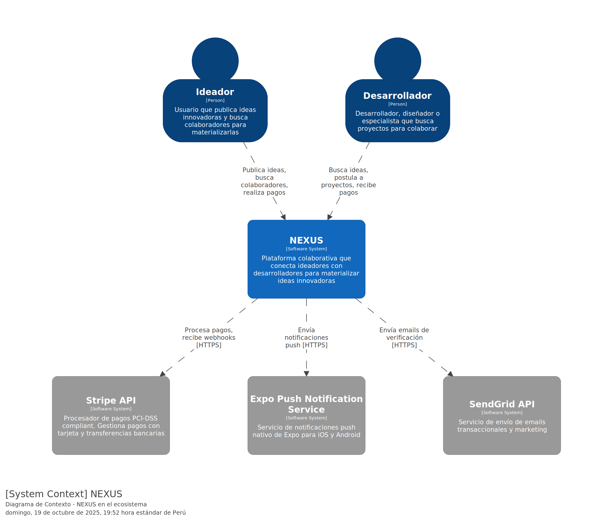

> [6. Documentación de Arquitectura (Bosquejo)](../6.md) › [6.1. Diagrama de Contexto](6.1.md)

# 6.1. Diagrama de Contexto

Muestra NEXUS en su ecosistema completo. Se visualizan los 2 tipos de usuarios (Ideador, Desarrollador) que interactúan con la plataforma, así como los sistemas externos necesarios para su funcionamiento: Stripe para pagos, SendGrid para emails transaccionales y Expo Push Notification Service para notificaciones móviles. Este diagrama proporciona una vista de alto nivel del alcance del sistema.

---

[🏠 Home](../../README.md) | [Siguiente ➡️](../6.2/6.2.md)
