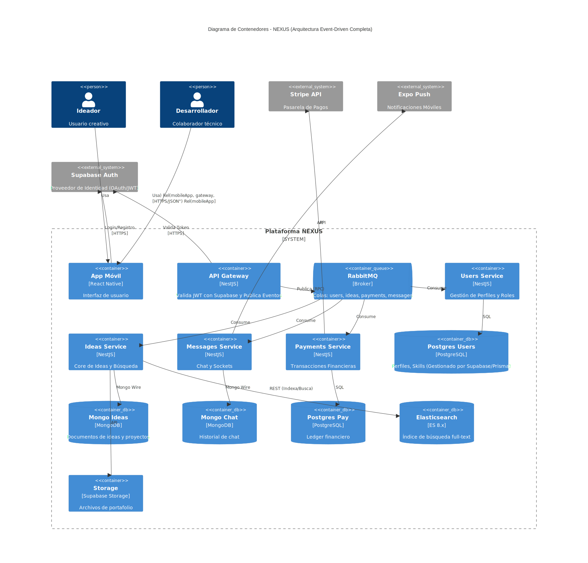

> [6. Documentación de Arquitectura (Bosquejo)](../6.md) › [6.2. Diagrama de Contenedores](6.2.md)

# 6.2. Diagrama de Contenedores

Presenta la arquitectura de microservicios de NEXUS. Cada módulo funcional (Perfil, Ideas, Búsqueda, Colaboración y Pagos) está implementado como un microservicio independiente con su propia base de datos. El API Gateway actúa como punto de entrada único, mientras que el Message Broker (RabbitMQ) facilita la comunicación asíncrona entre servicios. AWS S3 almacena archivos multimedia. Esta arquitectura permite escalabilidad independiente y despliegues aislados.

---

[⬅️ Anterior](../6.1/6.1.md) | [🏠 Home](../../README.md) | [Siguiente ➡️](../6.3/6.3.md)
