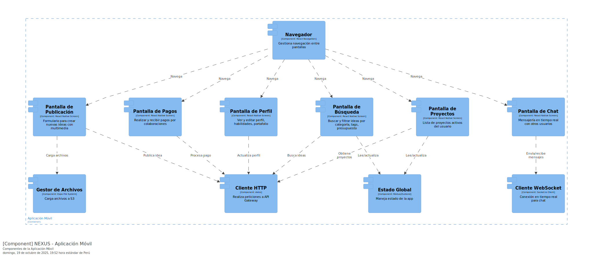
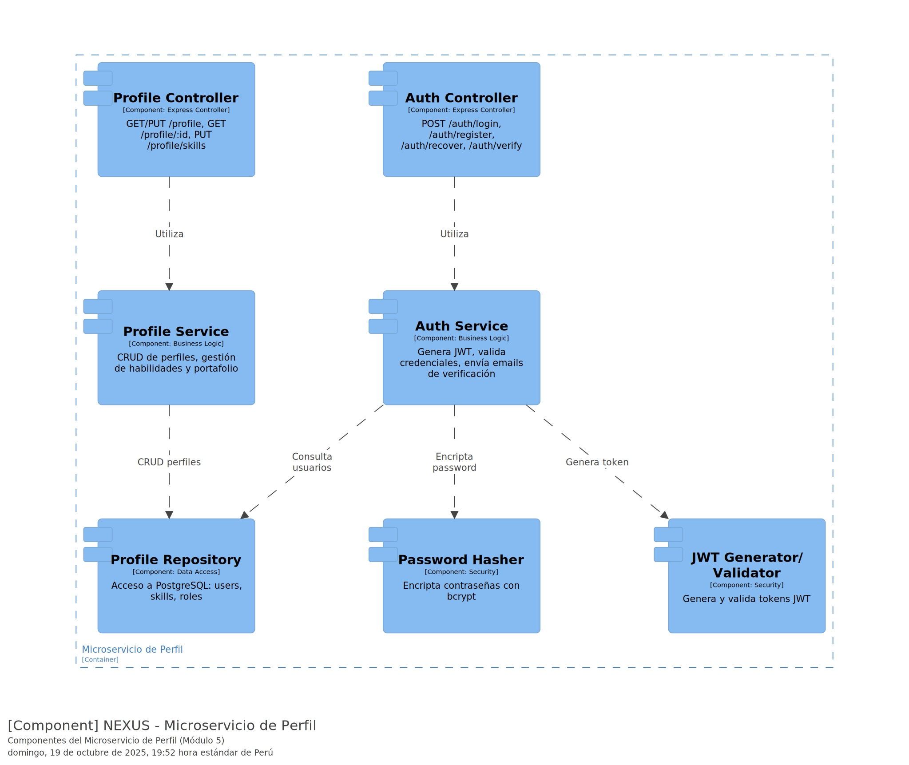
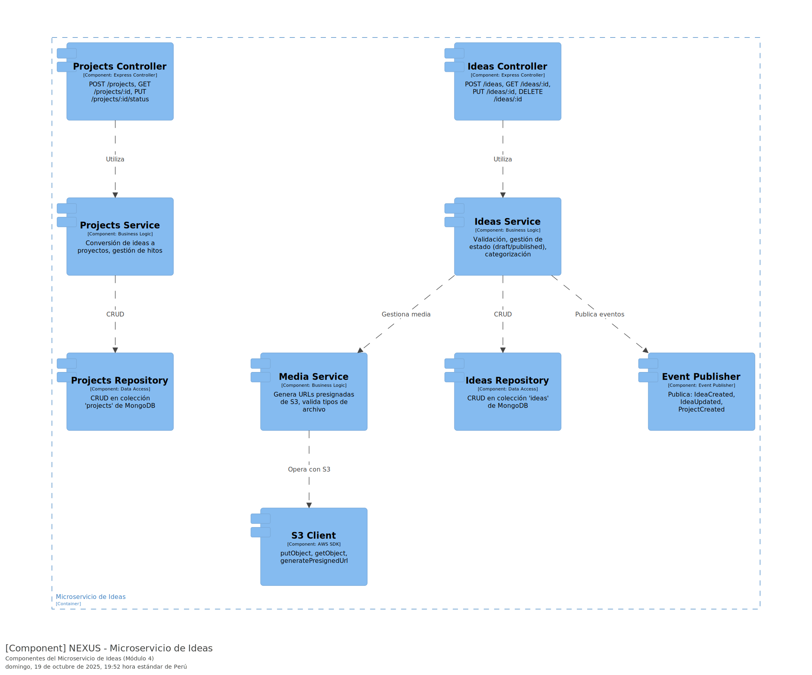
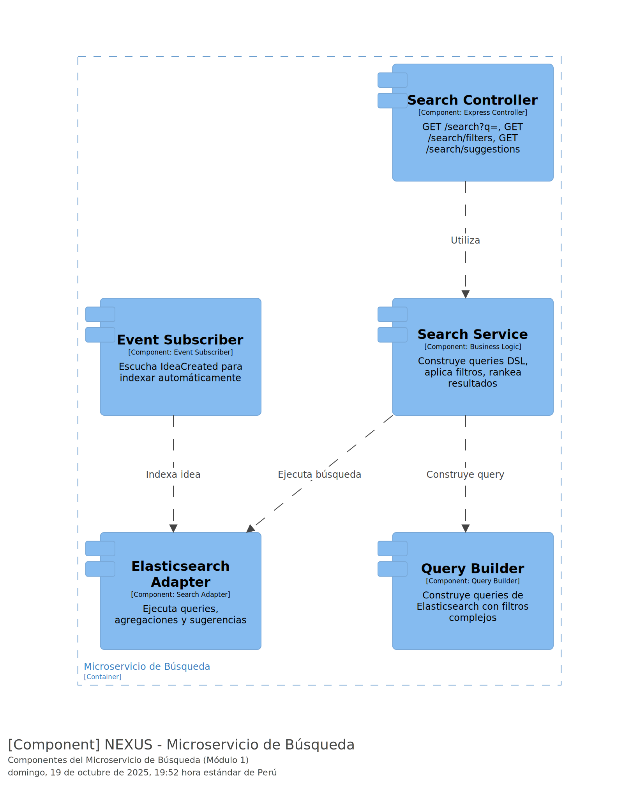
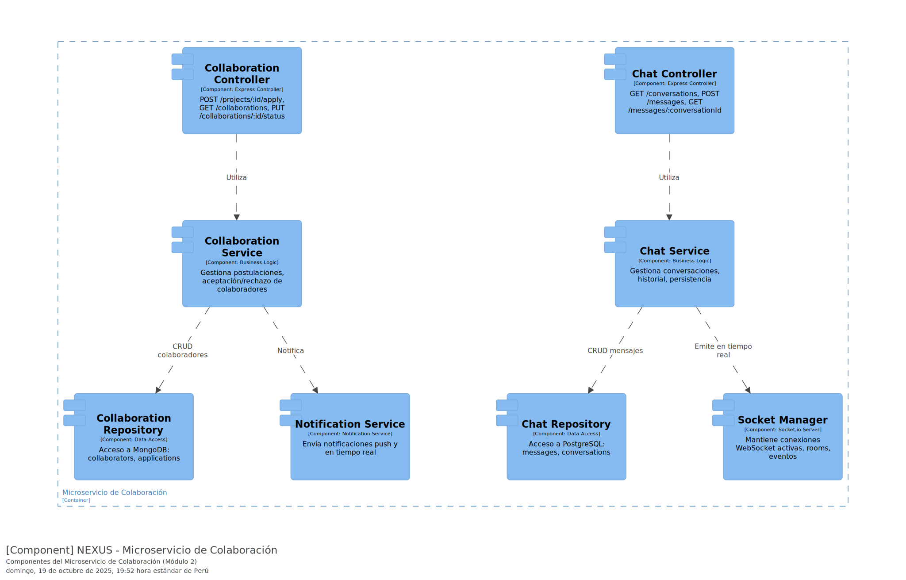
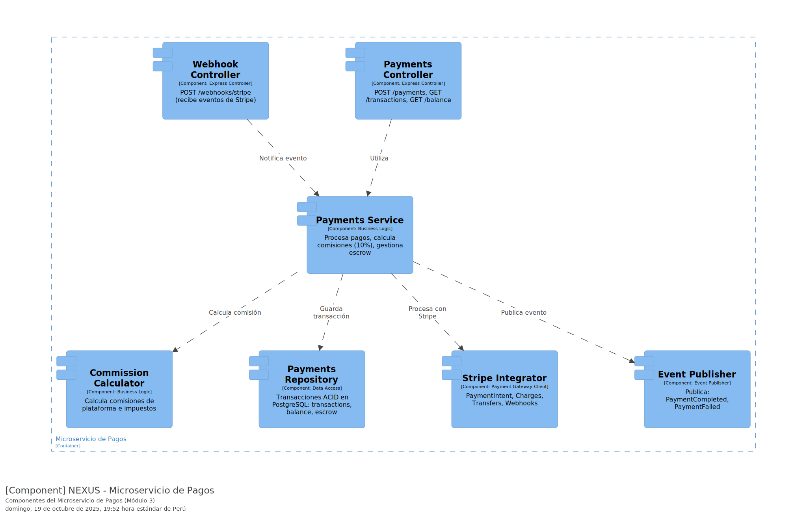
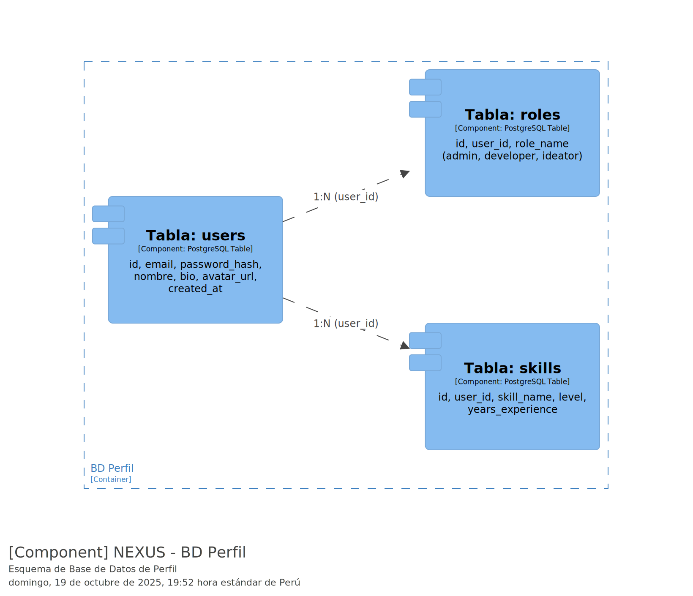
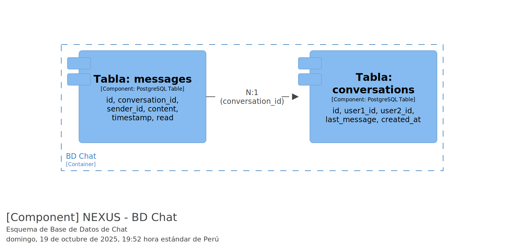
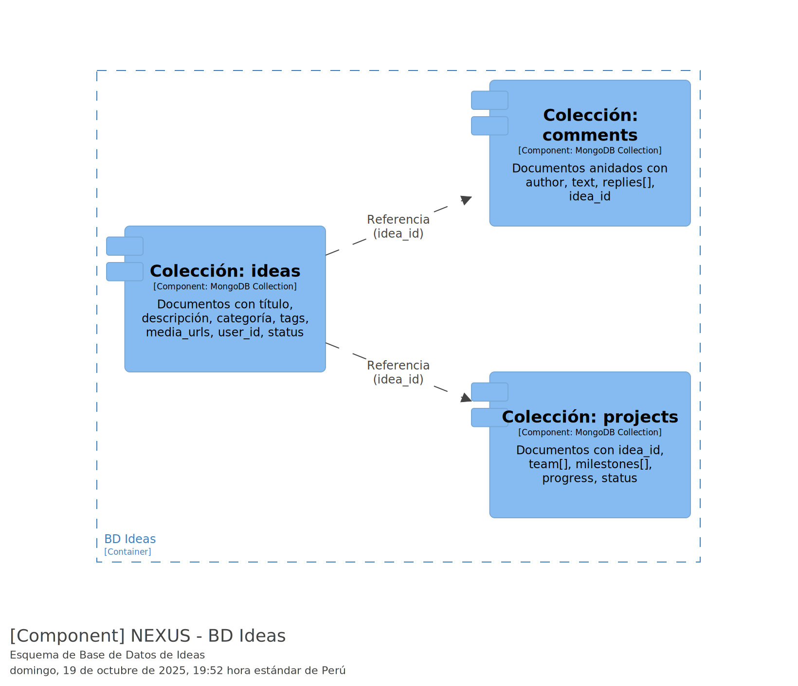
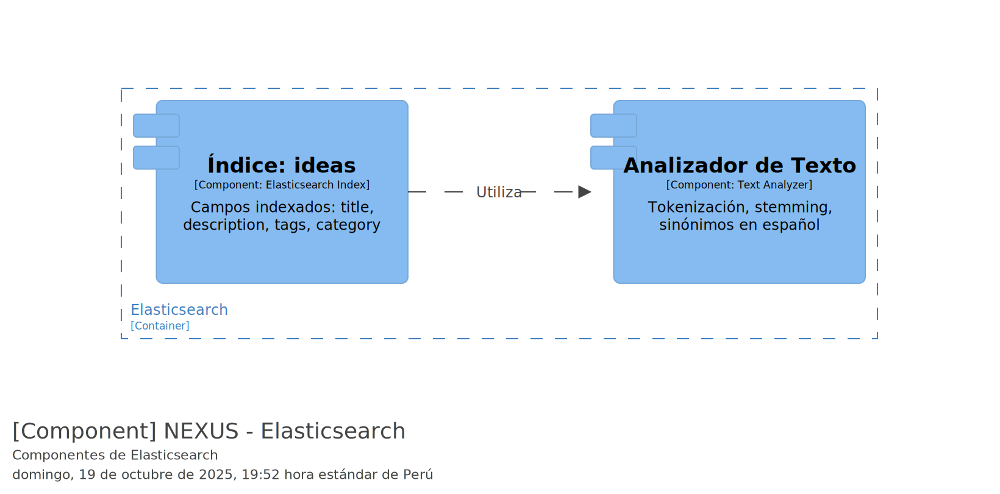

> [6. Documentación de Arquitectura (Bosquejo)](../6.md) › [6.3. Diagrama de Componentes](6.3.md)

# 6.3. Diagrama de Componentes

### Aplicacion React Native

Detalla la estructura interna de la aplicación React Native/Expo. Incluye las 6 pantallas principales (Búsqueda, Publicación, Perfil, Proyectos, Chat y Pagos), el sistema de navegación, gestión de estado global, cliente HTTP para API REST, cliente WebSocket para chat en tiempo real y el gestor de archivos para cargas a S3.

### Microservicio de Perfil

Gestiona la autenticación y perfiles de usuario. Incluye controladores para login/registro y gestión de perfiles, servicios de lógica de negocio, repositorio de acceso a PostgreSQL, hasher de contraseñas con bcrypt y generador/validador de tokens JWT. Es el responsable de la seguridad y control de acceso de toda la plataforma.

### Microservicio de Ideas

Núcleo funcional de NEXUS que gestiona la publicación de ideas y su conversión a proyectos. Incluye controladores REST, servicios de negocio para ideas y proyectos, gestión de archivos multimedia en S3, repositorios MongoDB y publicador de eventos para sincronización con el motor de búsqueda. Coordina la creación y evolución de ideas hacia proyectos ejecutables.

### Microservicio de Busqueda

Motor de búsqueda avanzada que permite encontrar ideas por texto, categorías, tags y presupuesto. Utiliza Elasticsearch para búsquedas full-text con análisis lingüístico en español. Incluye constructor de queries DSL, adaptador de Elasticsearch y suscriptor de eventos que indexa automáticamente nuevas ideas publicadas.

### Microservicio de Colaboracion

Gestiona la comunicación en tiempo real y postulaciones a proyectos. Incluye chat con WebSocket (Socket.io), gestión de conversaciones con persistencia en PostgreSQL, sistema de postulaciones almacenado en MongoDB, y servicio de notificaciones que integra con Expo Push Notifications para alertas en tiempo real.

### Microservicio de Pagos

Procesa transacciones financieras de forma segura. Integra con Stripe API para procesamiento de pagos, calcula comisiones de plataforma (10%), gestiona fondos en escrow hasta completar proyectos, maneja webhooks de Stripe para confirmaciones, y publica eventos de pagos completados. Garantiza transacciones ACID en PostgreSQL.

### Base de Datos Perfil

Esquema relacional que almacena información de usuarios. Incluye tabla de usuarios (credenciales, datos personales, avatar), habilidades (skills con nivel y años de experiencia) y roles (admin, developer, ideator). Mantiene integridad referencial mediante llaves foráneas.

### Base de Datos Chat 

Esquema relacional para el sistema de mensajería. Almacena conversaciones entre usuarios y mensajes con timestamp, estado de lectura y contenido. Optimizado para consultas de historial y notificaciones de mensajes no leídos.

### Base de Datos Pagos 

Esquema transaccional con garantías ACID para operaciones financieras. Incluye tabla de transacciones con referencias a Stripe, balance de usuarios (disponible y pendiente), y fondos en escrow con fecha de liberación. Diseñado para auditoría y reconciliación de pagos.

### Base de Datos Ideas

Almacenamiento documental flexible para ideas, proyectos y comentarios. La colección de ideas incluye título, descripción, categoría, tags y URLs de multimedia. Los proyectos contienen equipo, hitos y progreso. Los comentarios permiten anidación ilimitada. La estructura flexible permite evolución del esquema sin migraciones complejas.

### Elasticsearch 

Motor de búsqueda que indexa ideas para consultas rápidas. Incluye índice optimizado con campos tokenizados (título, descripción, tags, categoría) y analizador de texto en español con stemming y sinónimos. Permite búsquedas fuzzy y ranking por relevancia.

---

[⬅️ Anterior](../6.2/6.2.md) | [🏠 Home](../../README.md) | [Siguiente ➡️](../6.4/6.4.md)
