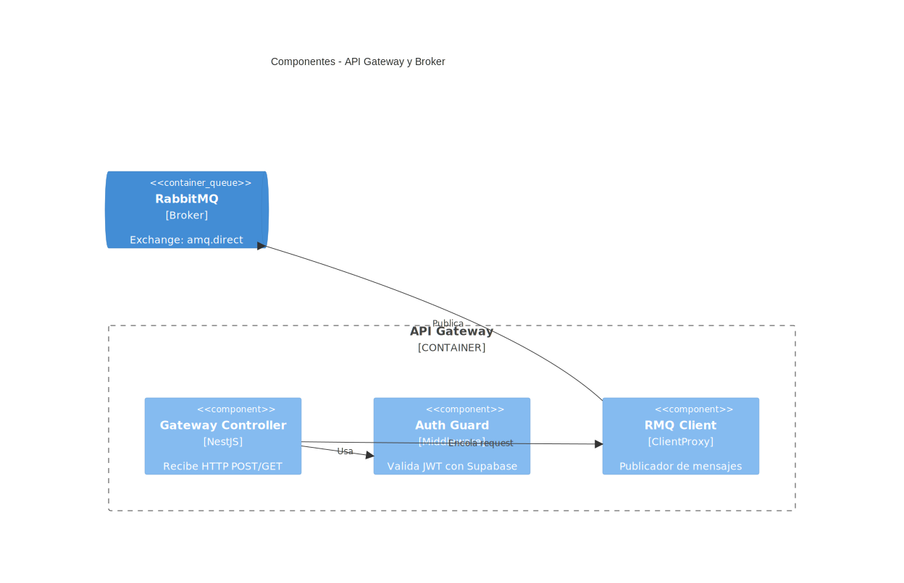
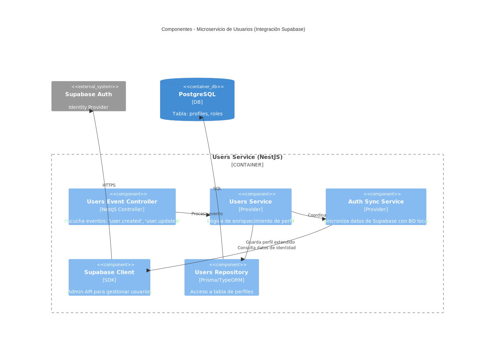
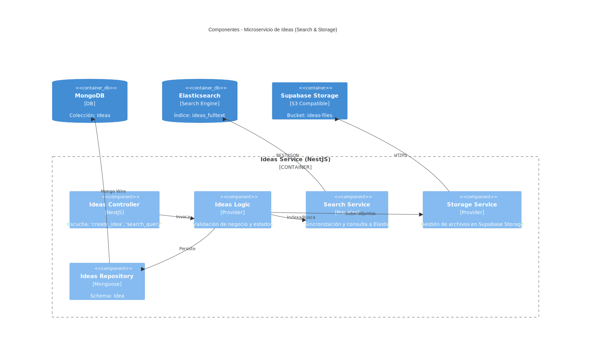
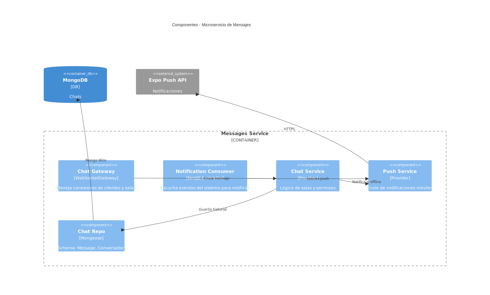
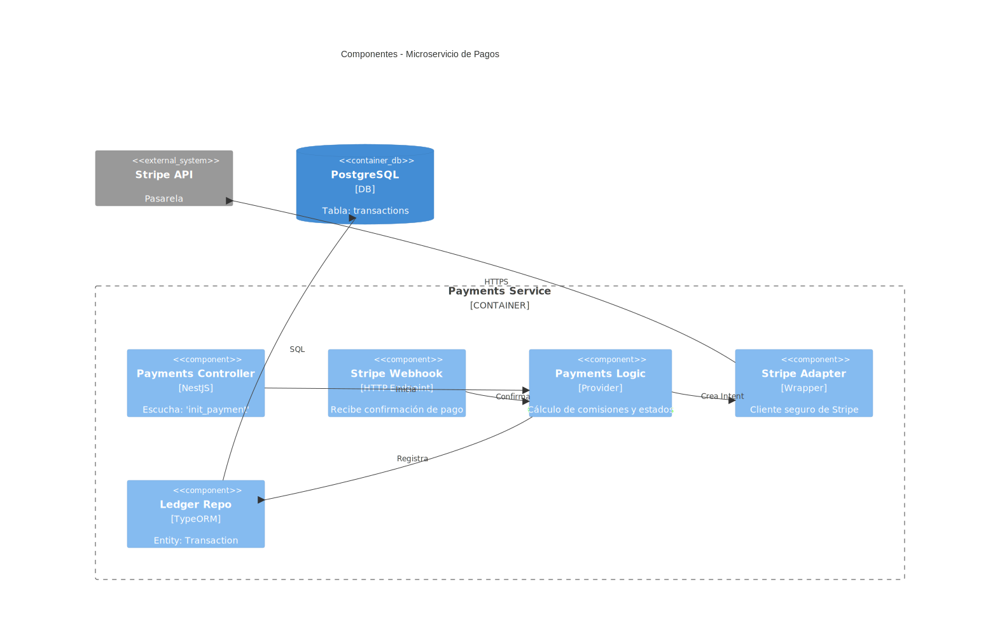

> [6. Documentación de Arquitectura (Bosquejo)](../6.md) › [6.3. Diagrama de Componentes](6.3.md)

# 6.3. Diagrama de Componentes
### 1. Aplicación Móvil (Frontend)

Este diagrama ilustra la arquitectura interna de la aplicación móvil desarrollada en **React Native**. Su objetivo es mostrar cómo se estructura el código del lado del cliente para separar las responsabilidades de presentación (UI), lógica de negocio (Controladores/Hooks) y comunicación con el backend (Servicios).

**Descripción de Elementos y Flujo:**

* **Capa de Vista (Presentational Components):** Aquí se encuentran los componentes visuales con los que interactúa el usuario, como `IdeasScreen` (para ver y crear ideas), `ChatScreen` (para mensajería) y `PaymentScreen` (para realizar pagos). Estos componentes son "tontos", es decir, solo se encargan de renderizar datos y capturar eventos del usuario, delegando la lógica a los hooks.
* **Capa de Controlador (Hooks & Logic):** Los Custom Hooks, como `useNexusController` y `useChatWebSocket`, actúan como el cerebro de la aplicación móvil.
    * `useNexusController`: Gestiona el estado global de la aplicación (ej. usuario autenticado, lista de ideas cargadas) y contiene la lógica de negocio del frontend (ej. validaciones de formulario antes de enviar).
    * `useChatWebSocket`: Maneja la lógica específica de la conexión en tiempo real, como escuchar eventos de "nuevo mensaje" o "escribiendo".
* **Capa de Servicio (Infraestructura):** Estos son módulos utilitarios que abstraen la comunicación con el mundo exterior.
    * `apiClient`: Una instancia de Axios configurada con la URL base del API Gateway y los interceptores para añadir el token de autenticación (JWT) en cada petición.
    * `socketClient`: El cliente de `socket.io` que mantiene el canal bidireccional abierto con el servidor de mensajes.
    * `storageService`: Utiliza `Expo FileSystem` para manejar la carga y caché de archivos locales (imágenes, documentos) antes de subirlos.

**Interacción:**
El usuario interactúa con una **Pantalla**, la cual invoca una función del **Hook** (Controlador). El Hook procesa la acción y llama al **Cliente API** o **Socket**, que finalmente se comunica con el **API Gateway** o el servicio de mensajes externo.

---

### 2. API Gateway & Broker (Entrada)

Este diagrama detalla el punto de entrada único al backend (**API Gateway**) y su integración con el bus de mensajes (**RabbitMQ**). Muestra cómo se manejan las peticiones entrantes, la seguridad y el enrutamiento asíncrono hacia los microservicios.

**Descripción de Elementos y Flujo:**

* **Unified Controller (Gateway Controller):** Es el controlador principal en NestJS que expone los endpoints REST públicos (ej. `POST /ideas`, `POST /payments`). Su función no es procesar el negocio, sino recibir la petición HTTP, validar su formato (DTOs) y delegarla.
* **Auth Guard (Middleware):** Un componente de seguridad crucial que intercepta cada petición antes de que llegue al controlador. Verifica la validez del token JWT contra **Supabase Auth** para asegurar que el usuario es quien dice ser y tiene permisos para realizar la acción.
* **RabbitMQ Proxy (ClientProxy):** Un módulo de NestJS configurado para actuar como "Productor" de mensajes AMQP.
* **RabbitMQ Broker:** El sistema de colas externo. Recibe los mensajes del Gateway y los distribuye a las colas específicas (`users`, `ideas`, `messages`, `payments`) basándose en patrones de enrutamiento.

**Interacción:**
Una petición HTTP llega al **Gateway**. El **Auth Guard** la valida. Si es válida, el **Controlador** toma los datos y usa el **RabbitMQ Proxy** para publicar un mensaje (evento o comando) en el **Broker**. El Gateway responde inmediatamente al cliente (ACK), liberando la conexión mientras el proceso continúa en segundo plano.

---

### 3. Microservicio de Usuarios

Este diagrama explica cómo se gestiona la identidad y el perfil de los usuarios, destacando la delegación de la autenticación a un servicio externo (**Supabase**) y la persistencia de datos adicionales en una base de datos relacional.

**Descripción de Elementos y Flujo:**

* **Users Consumer:** El punto de entrada del microservicio. No recibe HTTP, sino que escucha eventos de RabbitMQ (ej. `get_user_profile`, `update_user`).
* **Auth Service:** Contiene la lógica de negocio relacionada con usuarios. Coordina la creación de cuentas y la gestión de sesiones.
* **Supabase Client:** Un SDK que conecta con la API administrativa de Supabase. Se usa para operaciones críticas de identidad que no se pueden hacer directamente en la BD local.
* **Users Repository:** Utiliza un ORM (como TypeORM o Prisma) para interactuar con la base de datos **PostgreSQL**. Aquí se guardan los datos del perfil extendido que Supabase no maneja (ej. nivel de experiencia, biografía detallada, roles específicos de Nexus).

**Interacción:**
Cuando llega un mensaje para crear un usuario, el **Consumer** invoca al **Auth Service**. Este servicio puede consultar a **Supabase** para verificar datos de registro y luego usa el **Repository** para guardar el perfil en **PostgreSQL**.

---

### 4. Microservicio de Ideas

Este es el diagrama del núcleo de negocio de la plataforma. Muestra cómo se crean, validan y almacenan las ideas, y cómo se integran con capacidades de búsqueda avanzada (**Elasticsearch**).

**Descripción de Elementos y Flujo:**

* **Ideas Consumer:** Escucha eventos como `create_idea` o `update_idea` desde la cola de RabbitMQ.
* **Ideas Logic (Provider):** El corazón de la lógica de negocio. Aplica reglas como: "¿El usuario tiene límite de ideas?", "Validar formato de presupuesto", "Cambiar estado de borrador a publicado".
* **Search Sync (Service):** Un componente especializado encargado de mantener la consistencia entre la base de datos principal y el motor de búsqueda. Cada vez que una idea cambia, este servicio actualiza el índice en **Elasticsearch**.
* **Ideas Repo:** Abstracción de Mongoose para interactuar con **MongoDB**. MongoDB se elige por su flexibilidad para guardar la estructura variada de una idea (título, descripción, arrays de tags, objetos de archivos adjuntos).

**Interacción:**
El **Consumer** recibe la orden de crear una idea. **Ideas Logic** la valida y llama a **Ideas Repo** para guardarla en **MongoDB**. Paralelamente (o tras el guardado exitoso), invoca a **Search Sync** para indexar la idea en **Elasticsearch**, permitiendo que sea buscable casi en tiempo real.

---

### 5. Microservicio de Mensajes

Ilustra la arquitectura híbrida necesaria para un chat: comunicación en tiempo real para la experiencia de usuario y persistencia asíncrona para el historial.

**Descripción de Elementos y Flujo:**

* **Socket Gateway:** A diferencia de los otros servicios, este componente expone un puerto **WebSocket** (usando Socket.io) para mantener conexiones persistentes con las Apps Móviles. Gestiona eventos como `join_room` (unirse a un chat) y `send_message`.
* **Message Consumer:** Escucha eventos del sistema (ej. "Notificar usuario offline") desde RabbitMQ.
* **Chat Service (Logic):** Gestiona la lógica de las salas de chat, permisos (¿quién puede hablar con quién?) y orquesta el flujo del mensaje.
* **Chat Repo:** Guarda el historial de mensajes en **MongoDB**. Se usa Mongo aquí por su alta velocidad de escritura y capacidad de almacenar grandes volúmenes de logs de chat.

**Interacción:**
Un usuario envía un mensaje vía WebSocket al **Socket Gateway**. Este lo pasa al **Chat Service**, que hace dos cosas: 1) Retransmite el mensaje inmediatamente a los otros usuarios conectados en la sala (tiempo real), y 2) Llama al **Chat Repo** para guardar el mensaje en la base de datos para el futuro.

---

### 6. Microservicio de Pagos

Detalla el manejo seguro de transacciones financieras, el cálculo de comisiones de la plataforma y la integración con la pasarela de pagos externa (**Stripe**).

**Descripción de Elementos y Flujo:**

* **Payment Consumer:** Escucha comandos de pago (`process_payment`) iniciados por el usuario o el sistema.
* **Payment Logic (Provider):** Contiene las reglas financieras críticas: cálculo de comisiones de la plataforma (ej. 10%), validación de montos y estados de la transacción.
* **Stripe Adapter:** Un "wrapper" o envoltorio alrededor del SDK de Stripe. Su función es aislar la lógica de negocio de la implementación específica de Stripe, facilitando cambios futuros o pruebas (mocking).
* **Transaction Repo:** Guarda un registro inmutable (Ledger) de todas las transacciones, intentos y resultados en una base de datos relacional (**PostgreSQL**) para garantizar integridad ACID.

**Interacción:**
Al recibir una solicitud de pago, **Payment Logic** calcula los montos finales y usa el **Stripe Adapter** para crear un "Payment Intent" en la API de **Stripe**. Una vez que Stripe responde (o vía Webhook), el resultado se registra permanentemente en **PostgreSQL** mediante el **Transaction Repo**.

---

[⬅️ Anterior](../6.2/6.2.md) | [🏠 Home](../../README.md) | [Siguiente ➡️](../6.4/6.4.md)
