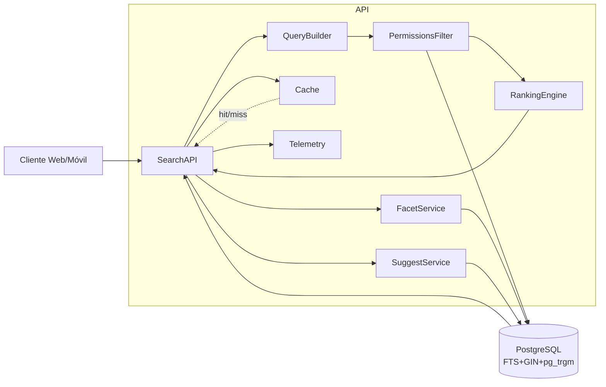

> [6. Documentación de Arquitectura (Bosquejo)](../6.md) › [6.3. Diagrama de Componentes](6.3.md)

# 6.3. Diagrama de Componentes

## Componentes – Módulo 1: Búsqueda de ideas

- **SearchAPI**: expone `GET /ideas/search` y `GET /ideas/suggest`.
- **QueryBuilder**: traduce parámetros (q, filtros, orden, paginación) a la consulta del motor (PostgreSQL FTS inicialmente).
- **PermissionsFilter**: aplica visibilidad (pública/privada/compartida) a toda consulta.
- **RankingEngine**: calcula relevancia (boost a `titulo`, `recencia`, `popularidad`).
- **FacetService**: calcula conteos de facetas (categoría, tags, habilidades, estado).
- **SuggestService**: genera sugerencias/autocomplete a partir de `q` parcial.
- **Cache**: almacena resultados de consultas populares y facetas (TTL corto).
- **Telemetry**: métricas (latencia p50/p95/p99, throughput, error rate) y eventos (`search_performed`, `result_click`).
- **Data Sources**: PostgreSQL (FTS con `GIN` y `pg_trgm`), tablas: `Idea`, `Categoria`, `Tag`, `IdeaTag`, `Habilidad`, `IdeaHabilidad`.

## Vista de Componentes

## Notas

- El `PermissionsFilter` se aplica siempre antes de calcular ranking o facetas.
- `Cache` usa claves normalizadas (query params ordenados) y TTL corto.
- `Telemetry` recoge latencias y CTR para ajustar relevancia.

---

[⬅️ Anterior](../6.2/6.2.md) | [🏠 Home](../../README.md) | [Siguiente ➡️](../6.4/6.4.md)