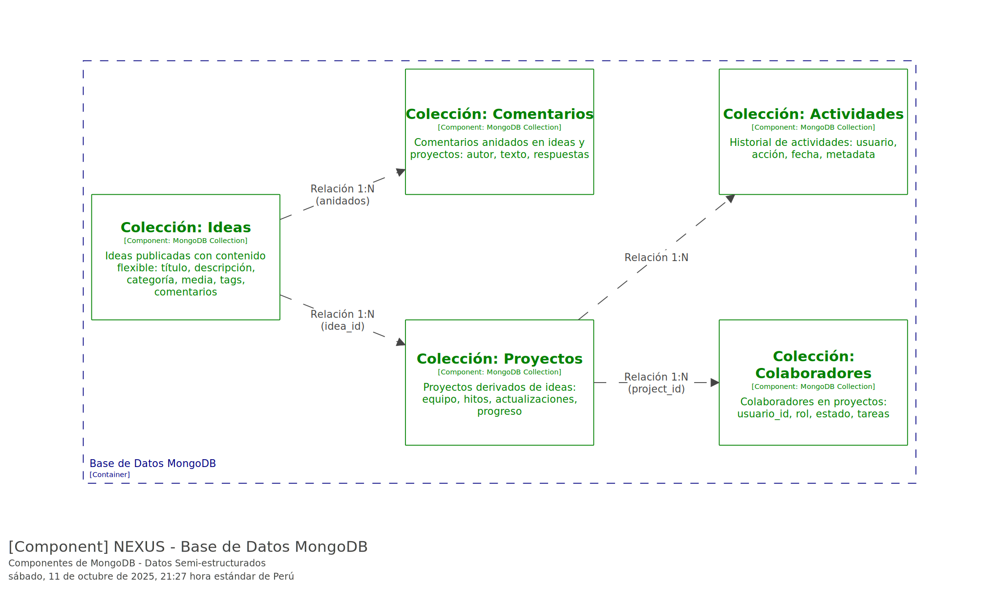
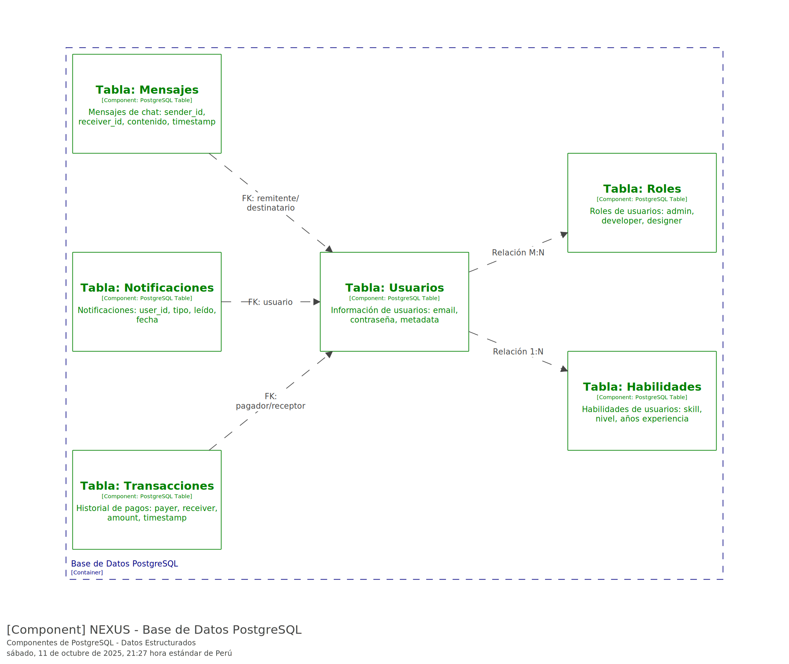
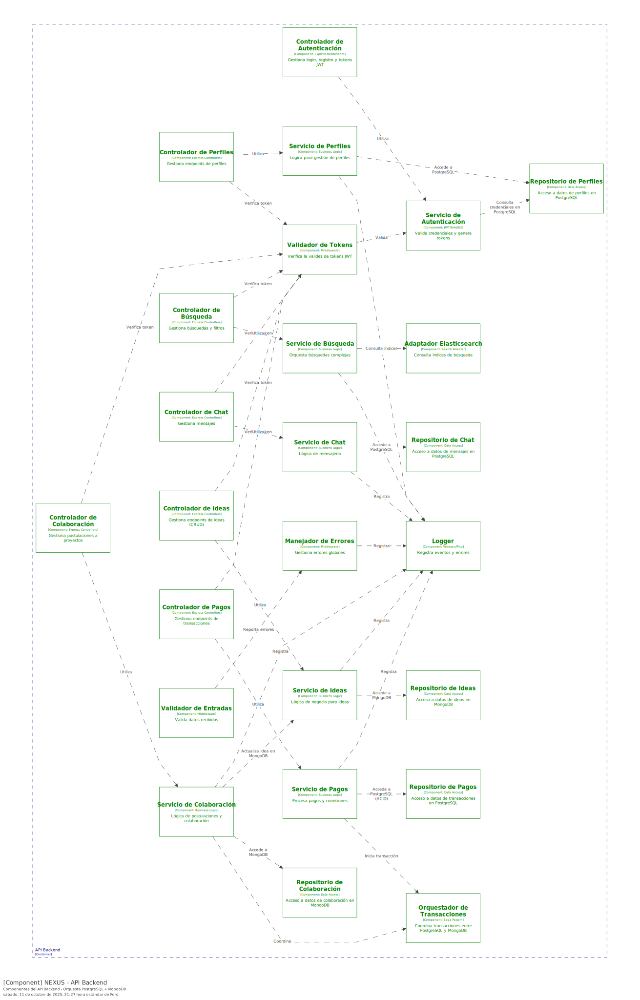

> [6. Documentación de Arquitectura (Bosquejo)](../6.md) › [6.3. Diagrama de Componentes](6.3.md)

# 6.3. Diagrama de Componentes

### Aplicacion React Native

La Aplicación React Native es la interfaz móvil y web que los usuarios ven en sus teléfonos y computadoras. Los Componentes UI son bloques visuales reutilizables (botones, tarjetas, formularios) que mantienen coherencia visual. Las seis Pantallas (Búsqueda, Publicación, Perfil, Proyectos, Chat, Pagos) utilizan estos componentes para mostrar funcionalidades específicas. El Navegador Stack gestiona la navegación entre pantallas, permitiendo ir hacia adelante y atrás. El Gestor de Estado almacena información global en la memoria del teléfono para evitar consultas innecesarias al servidor. El Cliente HTTP es el mensajero que comunica la app con el servidor backend, enviando y recibiendo datos. Todas las pantallas utilizan el Cliente HTTP para sus operaciones específicas: Búsqueda consulta ideas, Publicación envía nuevas ideas, Chat tiene conexión WebSocket directa para mensajes en tiempo real, Pagos procesa transacciones de manera segura.

### Base de datos MongoDB

MongoDB almacena datos flexibles que varían mucho en estructura. La Colección Ideas guarda todas las ideas publicadas con título, descripción, categoría, presupuesto, archivos y comentarios. La Colección Proyectos almacena proyectos derivados de ideas con equipo, hitos y progreso (relación 1:N con Ideas: una idea genera múltiples proyectos). La Colección Colaboradores registra quién trabaja en cada proyecto con su rol y estado (relación 1:N con Proyectos). La Colección Comentarios guarda comentarios anidados en ideas y proyectos, permitiendo threads de conversación. La Colección Actividades registra el historial de acciones en el sistema (quién hizo qué y cuándo) para auditoría y timeline. MongoDB es perfecta aquí porque las ideas, proyectos y comentarios son impredecibles en estructura y crecen constantemente.

### Base de datos PostgreSQL

PostgreSQL almacena datos estructurados que requieren máxima confiabilidad. La Tabla Usuarios guarda email, contraseña encriptada y metadata (relación 1:N con Habilidades, M:N con Roles). La Tabla Habilidades lista competencias técnicas con nivel de experiencia. La Tabla Roles define permisos del sistema (admin, developer, designer). La Tabla Transacciones es la más crítica: registra cada movimiento de dinero con pagador, receptor, cantidad y estado, con garantía ACID para que nunca se pierda o quede inconsistente. La Tabla Mensajes persiste chats: sender_id, receiver_id, contenido y timestamp. La Tabla Notificaciones almacena alertas para usuarios. PostgreSQL es esencial para estos datos porque garantiza integridad incluso si el sistema falla a mitad de una operación.

### API Backend

El API Backend es el cerebro que orquesta toda la lógica de negocio, dividido en capas especializadas. La Autenticación (Controlador, Servicio, Validador de Tokens) gestiona login y verifica que cada petición provenga de un usuario válido. La capa de Ideas (Controlador, Servicio, Repositorio) maneja publicación, búsqueda y actualización de ideas en MongoDB. La capa de Perfiles gestiona información de usuarios, habilidades y roles en PostgreSQL. La capa de Búsqueda (Controlador, Servicio, Adaptador) usa Elasticsearch para búsqueda full-text rápida de ideas. La capa de Colaboración maneja postulaciones y aceptación de colaboradores en proyectos, coordinando cambios entre MongoDB y el sistema de transacciones. La capa de Pagos procesa transacciones de manera segura en PostgreSQL con verificaciones rigurosas. La capa de Chat persiste mensajes en PostgreSQL pero usa Socket.io para entrega en tiempo real. Componentes transversales incluyen: Validador de Entradas (verifica que datos sean correctos), Manejador de Errores (captura y procesa excepciones), Logger (registra eventos para auditoría), y Orquestador de Transacciones (coordina operaciones multi-base de datos para garantizar consistencia, especialmente en pagos y colaboraciones).

---

[⬅️ Anterior](../6.2/6.2.md) | [🏠 Home](../../README.md) | [Siguiente ➡️](../6.4/6.4.md)
