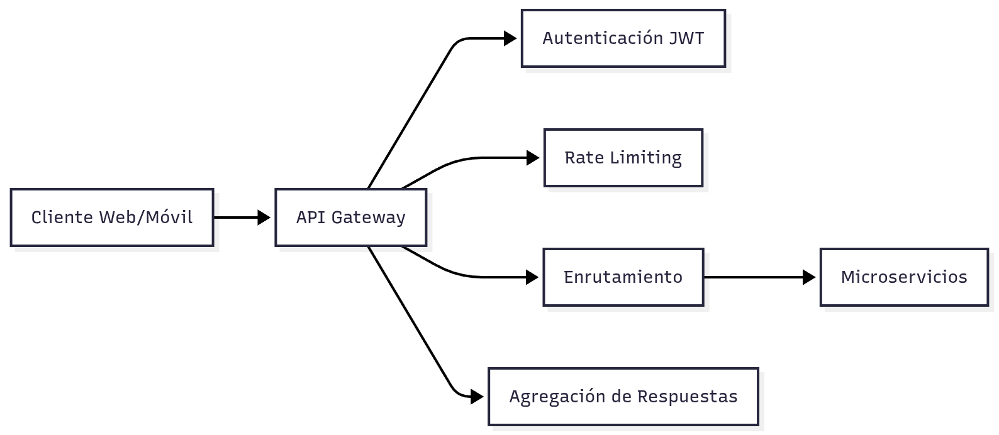
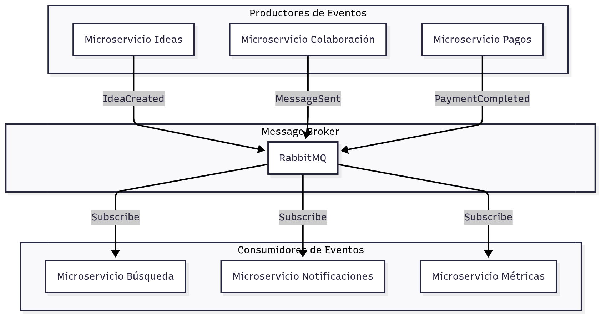
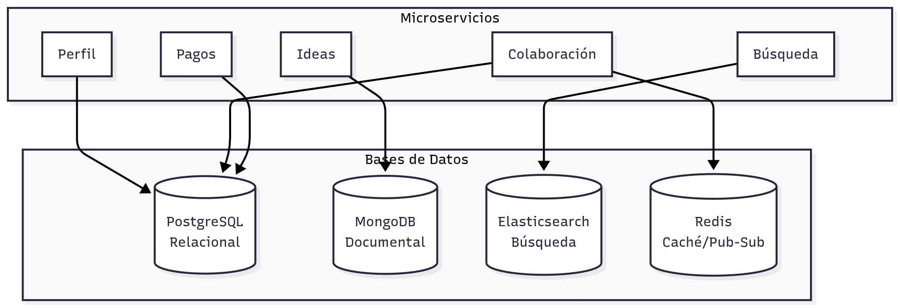

> [9. Metodología de Diseño de Arquitectura - Aplicación de ADD](../../9.md) › [9.2. Iteración 1: Definir la estructura general del sistema](../9.2.md) › [9.2.3. Conceptos de diseño](9.2.3.md)

# 9.2.3. Conceptos de diseño

## Conceptos de Diseño

Esta sección documenta los conceptos, patrones y estilos arquitectónicos seleccionados para estructurar el sistema NEXUS.

---

### 1. Estilo Arquitectónico Principal: Microservicios

#### Descripción

La arquitectura de microservicios descompone la aplicación en servicios pequeños, independientes y desplegables de forma autónoma, cada uno ejecutándose en su propio proceso y comunicándose mediante mecanismos ligeros (HTTP/REST, eventos).

#### Justificación para NEXUS

| Beneficio | Aplicación en NEXUS |
|---|---|
| **Modularidad** | Alineación directa con los 5 módulos del equipo (CON01) |
| **Escalabilidad independiente** | El módulo de Colaboración puede escalar sin afectar Pagos |
| **Tecnología heterogénea** | Permite usar PostgreSQL, MongoDB, Elasticsearch según necesidad |
| **Despliegue independiente** | Cada integrante puede desplegar su módulo sin coordinación compleja |
| **Resiliencia** | Fallo en Búsqueda no afecta Chat o Pagos |

#### Desventajas Aceptadas

- Mayor complejidad operacional (mitigada con contenedores y orquestación)
- Latencia de red entre servicios (mitigada con caché y comunicación asíncrona)
- Transacciones distribuidas (evitadas mediante diseño de bounded contexts)

---

### 2. Patrón: API Gateway

#### Descripción

Un único punto de entrada que enruta las peticiones a los microservicios correspondientes, centralizando funcionalidades transversales.

#### Responsabilidades del API Gateway

#### Implementación en NEXUS

- **Tecnología**: NGINX con configuración de proxy inverso
- **Funciones**:
  - Validación de tokens JWT (Gateway Offloading - trabajo individual Integrante 2)
  - Rate limiting por IP/usuario
  - Enrutamiento basado en path (`/api/ideas/*` → Microservicio Ideas)
  - Terminación SSL/TLS
  - Compresión de respuestas
  - CORS

#### Beneficios

- Simplifica clientes (un solo endpoint)
- Centraliza seguridad y políticas
- Reduce acoplamiento cliente-servicios

---

### 3. Patrón: Event-Driven Architecture (EDA)

#### Descripción

Los microservicios se comunican mediante eventos asíncronos publicados en un message broker, permitiendo desacoplamiento temporal y lógico.

#### Arquitectura de Eventos en NEXUS

#### Eventos Principales

| Evento | Productor | Consumidores | Propósito |
|---|---|---|---|
| `IdeaCreated` | Ideas | Búsqueda, Colaboración | Indexar idea, crear sala de chat |
| `IdeaUpdated` | Ideas | Búsqueda | Reindexar idea |
| `MessageSent` | Colaboración | Notificaciones | Enviar push notification |
| `PaymentCompleted` | Pagos | Ideas, Notificaciones | Actualizar estado, notificar usuario |
| `UserRegistered` | Perfil | Notificaciones | Enviar email de bienvenida |

#### Beneficios

- **Desacoplamiento**: Servicios no necesitan conocerse entre sí
- **Escalabilidad**: Procesamiento asíncrono de eventos
- **Resiliencia**: Eventos persisten en cola si consumidor está caído
- **Extensibilidad**: Nuevos consumidores sin modificar productores

---

### 4. Estrategia: Persistencia Poliglota

#### Descripción

Cada microservicio selecciona la tecnología de base de datos más adecuada a sus necesidades de datos.

#### Mapeo de Persistencia

#### Justificación por Servicio

| Microservicio | BD Principal | Razón |
|---|---|---|
| **Perfil** | PostgreSQL | Datos estructurados, relaciones (usuarios-roles-habilidades), ACID |
| **Ideas** | MongoDB | Esquema flexible (ideas evolucionan), documentos anidados (comentarios) |
| **Búsqueda** | Elasticsearch | Búsqueda full-text, filtros complejos, ranking por relevancia |
| **Colaboración** | PostgreSQL + Redis | SQL: mensajes persistentes; Redis: pub/sub, presencia en línea |
| **Pagos** | PostgreSQL | Transacciones ACID críticas, auditoría, integridad financiera |

---

### 5. Patrón: Backend for Frontend (BFF)

#### Descripción

Aunque no se implementa completamente en esta iteración, se considera para futuras optimizaciones: APIs específicas para web vs móvil.

#### Aplicación Futura

- **BFF Web**: Respuestas más ricas, paginación compleja
- **BFF Móvil**: Respuestas optimizadas, menor payload, agregación de datos

---

### 6. Estrategia de Comunicación

#### Comunicación Sincrónica (REST)

- **Uso**: Operaciones CRUD, consultas inmediatas
- **Protocolo**: HTTP/HTTPS con JSON
- **Patrón**: Request-Response
- **Ejemplo**: Cliente solicita lista de ideas → API Gateway → Microservicio Ideas

#### Comunicación Asincrónica (Eventos)

- **Uso**: Notificaciones, sincronización entre servicios
- **Protocolo**: AMQP (RabbitMQ)
- **Patrón**: Publish-Subscribe
- **Ejemplo**: Idea creada → Evento → Búsqueda indexa, Colaboración crea sala

#### Comunicación en Tiempo Real (WebSocket)

- **Uso**: Chat, notificaciones push, indicadores de presencia
- **Protocolo**: WebSocket (Socket.IO)
- **Patrón**: Bidireccional persistente
- **Ejemplo**: Usuario envía mensaje → WebSocket → Todos en sala reciben

---

### 7. Estrategia de Despliegue: Contenedores

#### Descripción

Cada microservicio se empaqueta en un contenedor Docker, permitiendo portabilidad y escalabilidad.

#### Beneficios

- **Consistencia**: Mismo entorno en desarrollo, staging, producción
- **Aislamiento**: Cada servicio con sus dependencias
- **Escalabilidad**: Orquestación con Kubernetes o Docker Swarm
- **CI/CD**: Pipelines automatizados por servicio

---

### Resumen de Decisiones

| Concepto | Selección | Alternativa Descartada | Razón |
|---|---|---|---|
| Estilo arquitectónico | Microservicios | Monolito modular | Equipos independientes, escalabilidad |
| API Gateway | NGINX | Kong, AWS API Gateway | Experiencia del equipo, control total |
| Message Broker | RabbitMQ | Kafka, AWS SQS | Simplicidad, suficiente para escala inicial |
| Persistencia | Poliglota | Una sola BD | Optimización por tipo de datos |
| Comunicación | REST + Eventos + WebSocket | Solo REST | Requisitos de tiempo real y desacoplamiento |

---

[⬅️ Anterior](../9.2.2/9.2.2.md) | [🏠 Home](../../../README.md) | [Siguiente ➡️](../9.2.4/9.2.4.md)