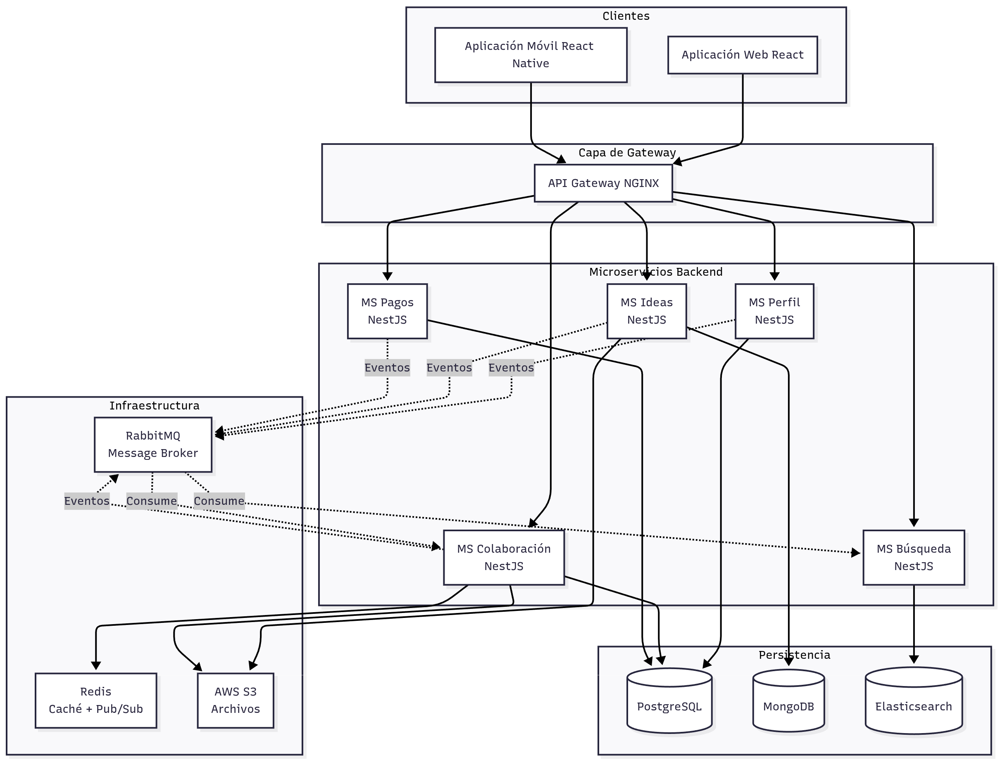

> [9. Metodología de Diseño de Arquitectura - Aplicación de ADD](../../9.md) › [9.2. Iteración 1: Definir la estructura general del sistema](../9.2.md) › [9.2.4. Elementos instanciados](9.2.4.md)

# 9.2.4. Elementos instanciados

## Elementos Instanciados

Esta sección documenta los elementos arquitectónicos concretos que resultan de aplicar los conceptos de diseño definidos en la sección anterior.

---

### Vista General de Elementos Instanciados

---

### 1. Aplicaciones Cliente

#### 1.1. Aplicación Web

| Atributo | Valor |
|---|---|
| **Nombre** | NEXUS Web App |
| **Tecnología** | React 18 + TypeScript + Vite |
| **Responsabilidad** | Interfaz de usuario web responsive |
| **Comunicación** | HTTP REST (API Gateway), WebSocket (Chat) |
| **Gestión de Estado** | Redux Toolkit |
| **Enrutamiento** | React Router v6 |
| **Puerto** | 3000 (desarrollo), 80/443 (producción) |

**Pantallas Principales**:
- Búsqueda de Ideas
- Publicación de Ideas
- Perfil de Usuario
- Proyectos Activos
- Chat de Colaboración
- Gestión de Pagos

#### 1.2. Aplicación Móvil

| Atributo | Valor |
|---|---|
| **Nombre** | NEXUS Mobile App |
| **Tecnología** | React Native + Expo SDK 49 |
| **Plataformas** | iOS 13+, Android 8+ |
| **Responsabilidad** | Interfaz móvil nativa |
| **Comunicación** | HTTP REST, WebSocket |
| **Navegación** | React Navigation v6 |
| **Notificaciones** | Expo Notifications |

---

### 2. Capa de Gateway

#### 2.1. API Gateway

| Atributo | Valor |
|---|---|
| **Nombre** | NEXUS API Gateway |
| **Tecnología** | NGINX 1.24 |
| **Responsabilidad** | Enrutamiento, autenticación, rate limiting |
| **Puerto** | 8080 (HTTP), 8443 (HTTPS) |
| **Configuración** | `/etc/nginx/nginx.conf` |

**Rutas de Enrutamiento**:

| Path | Microservicio Destino | Método |
|---|---|---|
| `/api/auth/*` | MS Perfil | POST, GET |
| `/api/users/*` | MS Perfil | GET, PUT, DELETE |
| `/api/ideas/*` | MS Ideas | GET, POST, PUT, DELETE |
| `/api/projects/*` | MS Ideas | GET, POST, PUT |
| `/api/search/*` | MS Búsqueda | GET |
| `/api/chat/*` | MS Colaboración | GET, POST |
| `/api/payments/*` | MS Pagos | POST, GET |
| `/ws/chat` | MS Colaboración (WebSocket) | WS |

**Funcionalidades Implementadas**:
- ✅ Validación JWT mediante `auth_request` (Gateway Offloading)
- ✅ Rate Limiting: 100 req/min por IP
- ✅ CORS configurado para dominios permitidos
- ✅ Compresión gzip
- ✅ Logs de acceso y errores

---

### 3. Microservicios Backend

#### 3.1. Microservicio de Perfil

| Atributo | Valor |
|---|---|
| **Nombre** | nexus-profile-service |
| **Tecnología** | NestJS 10 + TypeScript |
| **Puerto** | 3001 |
| **Base de Datos** | PostgreSQL (BD: nexus_profile) |
| **Responsabilidad** | Autenticación, gestión de usuarios, roles |

**Endpoints Principales**:
- `POST /auth/register` - Registro de usuario
- `POST /auth/login` - Inicio de sesión (retorna JWT)
- `POST /auth/logout` - Cierre de sesión
- `GET /users/:id` - Obtener perfil
- `PUT /users/:id` - Actualizar perfil
- `GET /users/:id/skills` - Obtener habilidades

**Eventos Publicados**:
- `UserRegistered` → Notificaciones (email bienvenida)
- `UserUpdated` → Caché (invalidación)

#### 3.2. Microservicio de Ideas

| Atributo | Valor |
|---|---|
| **Nombre** | nexus-ideas-service |
| **Tecnología** | NestJS 10 + TypeScript |
| **Puerto** | 3002 |
| **Base de Datos** | MongoDB (DB: nexus_ideas) |
| **Responsabilidad** | Publicación, gestión de ideas y proyectos |

**Endpoints Principales**:
- `POST /ideas` - Crear idea
- `GET /ideas/:id` - Obtener idea
- `PUT /ideas/:id` - Actualizar idea
- `DELETE /ideas/:id` - Eliminar idea
- `POST /ideas/:id/comments` - Comentar idea
- `POST /projects` - Convertir idea a proyecto

**Eventos Publicados**:
- `IdeaCreated` → Búsqueda (indexar), Colaboración (crear sala)
- `IdeaUpdated` → Búsqueda (reindexar)
- `IdeaDeleted` → Búsqueda (eliminar índice)

#### 3.3. Microservicio de Búsqueda

| Atributo | Valor |
|---|---|
| **Nombre** | nexus-search-service |
| **Tecnología** | NestJS 10 + TypeScript |
| **Puerto** | 3003 |
| **Motor de Búsqueda** | Elasticsearch 8.x |
| **Responsabilidad** | Búsqueda full-text, filtrado de ideas |

**Endpoints Principales**:
- `GET /search?q=...&category=...&tags=...` - Búsqueda de ideas
- `GET /search/suggestions?q=...` - Autocompletado

**Eventos Consumidos**:
- `IdeaCreated` → Indexar en Elasticsearch
- `IdeaUpdated` → Actualizar índice
- `IdeaDeleted` → Eliminar del índice

#### 3.4. Microservicio de Colaboración

| Atributo | Valor |
|---|---|
| **Nombre** | nexus-collaboration-service |
| **Tecnología** | NestJS 10 + Socket.IO + TypeScript |
| **Puerto** | 3004 (HTTP), 3004 (WebSocket) |
| **Base de Datos** | PostgreSQL (mensajes) + Redis (pub/sub) |
| **Responsabilidad** | Chat en tiempo real, postulaciones, notificaciones |

**Endpoints Principales**:
- `GET /chat/rooms` - Listar salas
- `POST /chat/rooms` - Crear sala
- `GET /chat/rooms/:id/messages` - Historial de mensajes
- `POST /applications` - Postular a proyecto
- `PUT /applications/:id` - Aceptar/rechazar postulación

**WebSocket Events**:
- `message:send` - Enviar mensaje
- `message:receive` - Recibir mensaje
- `user:typing` - Usuario escribiendo
- `user:online` - Usuario conectado

**Eventos Publicados**:
- `MessageSent` → Notificaciones (push notification)
- `ApplicationSubmitted` → Notificaciones

**Eventos Consumidos**:
- `IdeaCreated` → Crear sala de chat automáticamente

#### 3.5. Microservicio de Pagos

| Atributo | Valor |
|---|---|
| **Nombre** | nexus-payments-service |
| **Tecnología** | NestJS 10 + TypeScript |
| **Puerto** | 3005 |
| **Base de Datos** | PostgreSQL (BD: nexus_payments) |
| **Integración Externa** | Stripe API |
| **Responsabilidad** | Procesamiento de pagos, recompensas, escrow |

**Endpoints Principales**:
- `POST /payments/intent` - Crear intención de pago
- `POST /payments/confirm` - Confirmar pago
- `GET /payments/:id` - Obtener estado de pago
- `POST /webhooks/stripe` - Webhook de Stripe
- `GET /balance/:userId` - Obtener balance de usuario

**Eventos Publicados**:
- `PaymentCompleted` → Ideas (actualizar estado), Notificaciones
- `PaymentFailed` → Notificaciones

---

### 4. Infraestructura de Soporte

#### 4.1. Message Broker

| Atributo | Valor |
|---|---|
| **Nombre** | RabbitMQ Cluster |
| **Versión** | RabbitMQ 3.12 |
| **Puerto** | 5672 (AMQP), 15672 (Management UI) |
| **Exchanges** | `nexus.events` (topic) |
| **Queues** | `search.index`, `notifications.push`, `metrics.collect` |

**Configuración**:
- Persistencia de mensajes habilitada
- Dead Letter Queue configurada
- TTL de mensajes: 24 horas

#### 4.2. Caché Distribuida

| Atributo | Valor |
|---|---|
| **Nombre** | Redis Cluster |
| **Versión** | Redis 7.0 |
| **Puerto** | 6379 |
| **Uso** | Caché de sesiones, pub/sub para WebSocket, rate limiting |

**Estrategias de Caché**:
- Perfiles de usuario: TTL 1 hora
- Ideas populares: TTL 15 minutos
- Resultados de búsqueda: TTL 5 minutos

#### 4.3. Almacenamiento de Archivos

| Atributo | Valor |
|---|---|
| **Nombre** | AWS S3 Bucket |
| **Bucket** | `nexus-media-prod` |
| **Región** | us-east-1 |
| **Uso** | Imágenes de ideas, avatares, documentos adjuntos |

**Configuración**:
- Acceso público para imágenes (con firma)
- Versionado habilitado
- Lifecycle policy: eliminar después de 90 días si no referenciado

---

### 5. Bases de Datos

#### 5.1. PostgreSQL

| Atributo | Valor |
|---|---|
| **Versión** | PostgreSQL 2022 |
| **Puerto** | 1433 |
| **Bases de Datos** | `nexus_profile`, `nexus_collaboration`, `nexus_payments` |

**Esquemas**:
- **nexus_profile**: Users, Roles, Skills, UserSkills
- **nexus_collaboration**: Conversations, Messages, Applications
- **nexus_payments**: Transactions, Balances, Escrow

#### 5.2. MongoDB

| Atributo | Valor |
|---|---|
| **Versión** | MongoDB 7.0 |
| **Puerto** | 27017 |
| **Base de Datos** | `nexus_ideas` |

**Colecciones**:
- `ideas`: Documentos de ideas con metadata
- `projects`: Proyectos activos
- `comments`: Comentarios anidados

#### 5.3. Elasticsearch

| Atributo | Valor |
|---|---|
| **Versión** | Elasticsearch 8.10 |
| **Puerto** | 9200 (HTTP), 9300 (Transport) |
| **Índice** | `nexus_ideas_index` |

**Configuración del Índice**:
- Analizador en español
- Campos: title (boost 2.0), description, tags, category
- Fuzzy matching habilitado

---

### Tabla Resumen de Elementos Instanciados

| Categoría | Elemento | Tecnología | Puerto | Estado |
|---|---|---|---|---|
| Cliente | Web App | React | 3000 | ✅ Definido |
| Cliente | Mobile App | React Native | - | ✅ Definido |
| Gateway | API Gateway | NGINX | 8080 | ✅ Definido |
| Microservicio | Perfil | NestJS | 3001 | ✅ Definido |
| Microservicio | Ideas | NestJS | 3002 | ✅ Definido |
| Microservicio | Búsqueda | NestJS | 3003 | ✅ Definido |
| Microservicio | Colaboración | NestJS + Socket.IO | 3004 | ✅ Definido |
| Microservicio | Pagos | NestJS | 3005 | ✅ Definido |
| Infraestructura | RabbitMQ | RabbitMQ | 5672 | ✅ Definido |
| Infraestructura | Redis | Redis | 6379 | ✅ Definido |
| Infraestructura | S3 | AWS S3 | - | ✅ Definido |
| Base de Datos | PostgreSQL | PostgreSQL | 1433 | ✅ Definido |
| Base de Datos | MongoDB | MongoDB | 27017 | ✅ Definido |
| Base de Datos | Elasticsearch | Elasticsearch | 9200 | ✅ Definido |

---

[⬅️ Anterior](../9.2.3/9.2.3.md) | [🏠 Home](../../../README.md) | [Siguiente ➡️](../9.2.5/9.2.5.md)