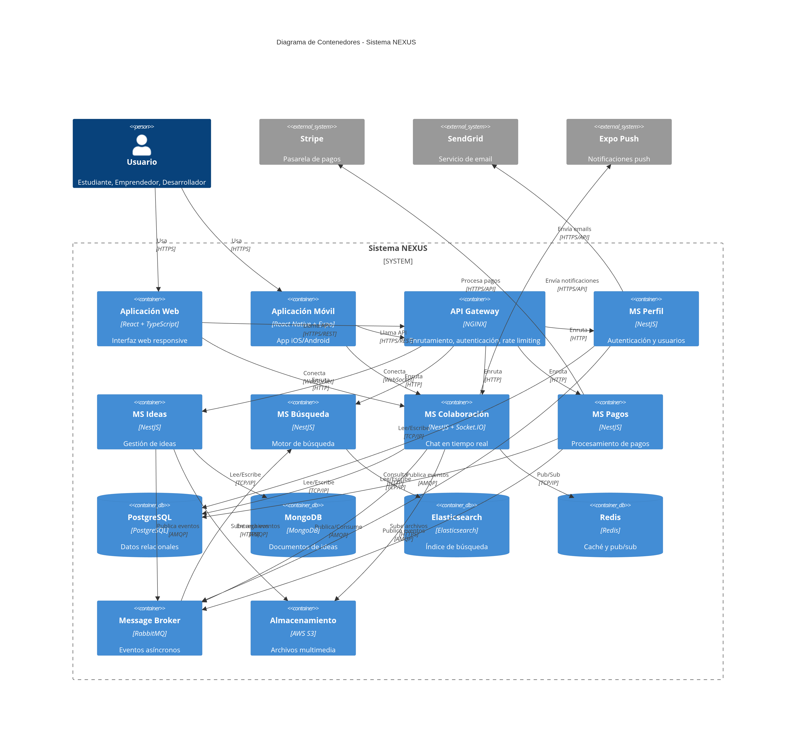
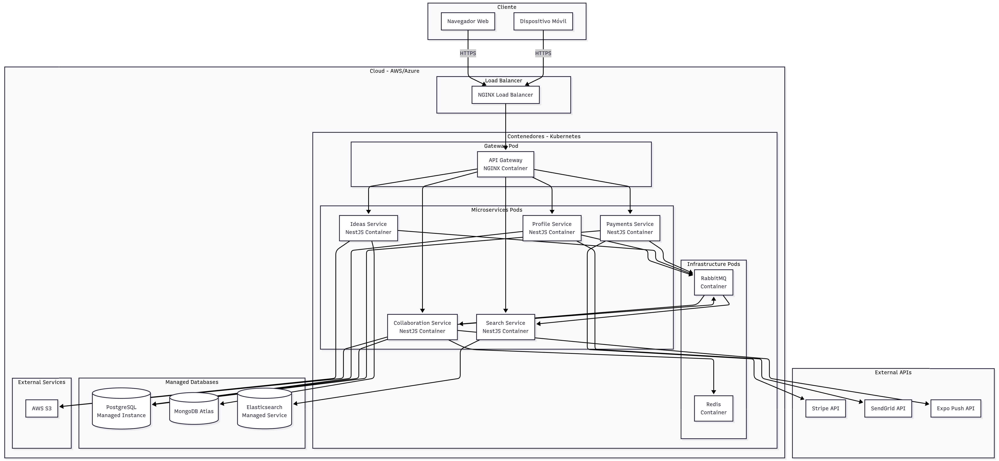
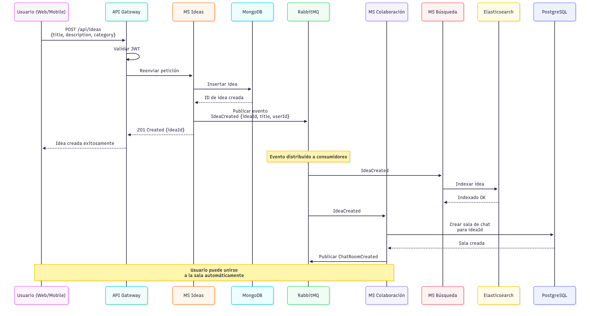

> [9. Metodología de Diseño de Arquitectura - Aplicación de ADD](../../9.md) › [9.2. Iteración 1: Definir la estructura general del sistema](../9.2.md) › [9.2.5. Vistas y Decisiones](9.2.5.md)

# 9.2.5. Vistas y Decisiones

## Vistas y Decisiones

Esta sección presenta las vistas arquitectónicas resultantes de la Iteración 1 y documenta las decisiones clave tomadas.

---

### Vista 1: Diagrama de Contenedores (C4 Level 2)

---

### Vista 2: Diagrama de Despliegue

---

### Vista 3: Flujo de Comunicación - Crear Idea y Sala de Chat

---

### Decisiones Arquitectónicas

#### Decisión 1: Adopción de Arquitectura de Microservicios

| Aspecto | Detalle |
|---|---|
| **Contexto** | Sistema con 5 módulos funcionales independientes, desarrollados por 5 integrantes |
| **Decisión** | Implementar arquitectura de microservicios con un servicio por módulo |
| **Alternativas** | Monolito modular, SOA tradicional |
| **Justificación** | - Alineación con estructura del equipo (CON01) - Despliegue independiente por integrante - Escalabilidad diferenciada (chat requiere más recursos) - Tecnologías heterogéneas (SQL, MongoDB, Elasticsearch) |
| **Consecuencias** | ✅ Autonomía de equipos ✅ Escalabilidad granular ⚠️ Complejidad operacional ⚠️ Latencia de red |
| **Mitigación** | Contenedores Docker + Kubernetes, caché distribuida, comunicación asíncrona |

#### Decisión 2: NGINX como API Gateway

| Aspecto | Detalle |
|---|---|
| **Contexto** | Necesidad de punto de entrada único para clientes web y móvil |
| **Decisión** | Usar NGINX como API Gateway con Gateway Offloading |
| **Alternativas** | Kong, AWS API Gateway, Traefik |
| **Justificación** | - Experiencia del equipo (Integrante 2 implementó demo) - Control total sobre configuración - Rendimiento probado - Sin costos de licencia |
| **Consecuencias** | ✅ Centralización de autenticación y rate limiting ✅ Simplicidad para clientes ⚠️ Configuración manual (no UI) |
| **Implementación** | `auth_request` para validación JWT, `limit_req_zone` para rate limiting |

#### Decisión 3: RabbitMQ para Event-Driven Architecture

| Aspecto | Detalle |
|---|---|
| **Contexto** | Necesidad de desacoplar microservicios y manejar comunicación asíncrona |
| **Decisión** | Implementar RabbitMQ como message broker central |
| **Alternativas** | Apache Kafka, AWS SQS, Redis Pub/Sub |
| **Justificación** | - Simplicidad para escala inicial - Soporte AMQP estándar - Garantías de entrega (acknowledgments) - Dead Letter Queues para manejo de errores |
| **Consecuencias** | ✅ Desacoplamiento temporal y lógico ✅ Resiliencia (eventos persisten) ⚠️ Menor throughput que Kafka (aceptable para NEXUS) |
| **Patrones** | Publish-Subscribe para eventos de dominio |

#### Decisión 4: Persistencia Poliglota

| Aspecto | Detalle |
|---|---|
| **Contexto** | Diferentes microservicios con diferentes necesidades de datos |
| **Decisión** | Cada microservicio selecciona su BD óptima |
| **Alternativas** | Una sola BD relacional para todo |
| **Justificación** | - **PostgreSQL**: Transacciones ACID para Perfil, Colaboración, Pagos - **MongoDB**: Flexibilidad de esquema para Ideas - **Elasticsearch**: Búsqueda full-text optimizada - **Redis**: Caché de alto rendimiento y pub/sub |
| **Consecuencias** | ✅ Optimización por tipo de datos ✅ Escalabilidad independiente ⚠️ No hay transacciones distribuidas (diseñar bounded contexts) |
| **Restricción** | Cumple CON05 (PostgreSQL como BD principal para 3 servicios) |

#### Decisión 5: Comunicación Híbrida (REST + WebSocket + Eventos)

| Aspecto | Detalle |
|---|---|
| **Contexto** | Diferentes patrones de interacción: CRUD, tiempo real, notificaciones |
| **Decisión** | Usar REST para operaciones síncronas, WebSocket para chat, Eventos para integración |
| **Alternativas** | Solo REST con polling, solo gRPC |
| **Justificación** | - **REST**: Estándar, fácil de consumir, stateless - **WebSocket**: Latencia baja para chat (ESC-01) - **Eventos**: Desacoplamiento entre servicios (ESC-07) |
| **Consecuencias** | ✅ Cada patrón para su caso de uso óptimo ⚠️ Mayor complejidad en clientes |
| **Restricciones** | Cumple CON03 (REST) y CON04 (WebSocket) |

#### Decisión 6: Contenedores Docker + Orquestación Kubernetes

| Aspecto | Detalle |
|---|---|
| **Contexto** | Necesidad de despliegue consistente y escalable en cloud |
| **Decisión** | Empaquetar cada microservicio en contenedor Docker, orquestar con Kubernetes |
| **Alternativas** | VMs tradicionales, Docker Swarm, serverless |
| **Justificación** | - Portabilidad entre entornos - Escalado automático (HPA) - Self-healing (restart automático) - Estándar de industria |
| **Consecuencias** | ✅ Consistencia dev/prod ✅ Escalabilidad automática ⚠️ Curva de aprendizaje Kubernetes |
| **Restricción** | Cumple CON06 (despliegue en cloud con contenedores) |

---

### Mapeo de Restricciones a Decisiones

| Restricción | Decisión que la Satisface | Evidencia |
|---|---|---|
| CON01: Arquitectura modular | Microservicios (1 por módulo) | 5 microservicios alineados a módulos |
| CON02: Stack Node.js, PostgreSQL, React | Tecnologías seleccionadas | NestJS (Node.js), PostgreSQL, React/RN |
| CON03: Comunicación REST | API Gateway + REST | Endpoints REST en todos los microservicios |
| CON04: WebSocket para mensajería | Socket.IO en MS Colaboración | WebSocket para chat en tiempo real |
| CON05: Persistencia PostgreSQL | PostgreSQL para 3 servicios | Perfil, Colaboración, Pagos usan PostgreSQL |
| CON06: Despliegue cloud/contenedores | Docker + Kubernetes | Todos los servicios containerizados |
| CON07: Patrón Sharding (Integrante 2) | Redis Pub/Sub para escalado | Socket.IO Redis Adapter (Iteración 3) |

---

### Mapeo de Preocupaciones a Decisiones

| Preocupación | Decisión que la Aborda | Cómo |
|---|---|---|
| CRN04: Integración entre módulos | Event-Driven Architecture | RabbitMQ permite comunicación desacoplada |
| CRN05: Mantenibilidad | Microservicios + Contenedores | Cambios aislados por servicio |
| CRN06: Observabilidad | Logs centralizados (futura) | Preparado para ELK Stack |

---

### Análisis de Riesgos

| Riesgo | Probabilidad | Impacto | Mitigación |
|---|---|---|---|
| Latencia entre microservicios | Media | Medio | Caché Redis, comunicación asíncrona |
| Complejidad operacional | Alta | Medio | Kubernetes maneja orquestación |
| Fallo de RabbitMQ | Baja | Alto | Cluster RabbitMQ, Dead Letter Queues |
| Inconsistencia de datos | Media | Alto | Diseño de bounded contexts, eventual consistency |
| Sobrecarga de API Gateway | Media | Alto | Escalado horizontal de NGINX |

---

### Próximos Pasos

En la **Iteración 2**, se descompondrán los microservicios en componentes internos (Controllers, Services, Repositories) para soportar los casos de uso principales.

---

[⬅️ Anterior](../9.2.4/9.2.4.md) | [🏠 Home](../../../README.md) | [Siguiente ➡️](../9.1.6/9.1.6.md)