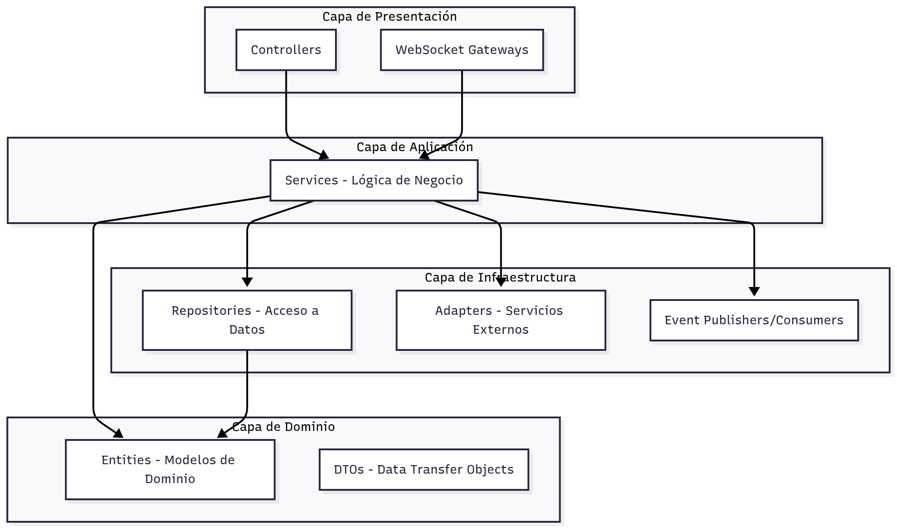

> [9. Metodología de Diseño de Arquitectura - Aplicación de ADD](../../9.md) › [9.3. Iteración 2: Identificar estructuras para soportar la funcionalidad primaria](../9.3.md) › [9.3.2. Elementos a refinar](9.3.2.md)

# 9.3.2. Elementos a refinar

## Elementos a Refinar

En esta iteración, los elementos a refinar son **los 5 microservicios** definidos en la Iteración 1. Cada microservicio se descompondrá en componentes internos que implementarán los casos de uso asignados.

---

### Microservicio 1: Perfil (nexus-profile-service)

**Responsabilidad**: Autenticación, gestión de usuarios y roles

**Casos de Uso a Soportar**:
- CU01: Registro de usuario
- CU02: Inicio de sesión
- CU03: Cierre de sesión
- CU12: Gestión de usuarios y salas (admin)
- CU13: Dashboard de actividad (admin)

**Descomposición Propuesta**:
- **AuthController**: Endpoints de autenticación (register, login, logout)
- **UserController**: Endpoints de gestión de usuarios
- **AdminController**: Endpoints administrativos
- **AuthService**: Lógica de autenticación y generación de JWT
- **UserService**: Lógica de gestión de perfiles y habilidades
- **AdminService**: Lógica de administración
- **UserRepository**: Acceso a datos de usuarios (PostgreSQL)
- **JwtAdapter**: Generación y validación de tokens
- **BcryptAdapter**: Hashing de contraseñas
- **SendGridAdapter**: Envío de emails de bienvenida
- **EventPublisher**: Publicación de eventos (UserRegistered, UserUpdated)

---

### Microservicio 2: Ideas (nexus-ideas-service)

**Responsabilidad**: Publicación y gestión de ideas y proyectos

**Casos de Uso a Soportar**:
- CU04: Registrar idea
- CU11: Calificar impacto de una idea (comentarios/ratings)

**Descomposición Propuesta**:
- **IdeaController**: Endpoints CRUD de ideas
- **ProjectController**: Endpoints de proyectos
- **CommentController**: Endpoints de comentarios
- **IdeaService**: Lógica de negocio de ideas
- **ProjectService**: Lógica de conversión idea → proyecto
- **CommentService**: Lógica de comentarios y ratings
- **IdeaRepository**: Acceso a MongoDB (colección ideas)
- **ProjectRepository**: Acceso a MongoDB (colección projects)
- **S3Adapter**: Subida de imágenes/archivos a AWS S3
- **EventPublisher**: Publicación de eventos (IdeaCreated, IdeaUpdated, IdeaDeleted)

---

### Microservicio 3: Búsqueda (nexus-search-service)

**Responsabilidad**: Motor de búsqueda y recomendaciones

**Casos de Uso a Soportar**:
- CU05: Explorar ideas (búsqueda y filtrado)
- CU10: Sugerir ideas afines (recomendaciones)

**Descomposición Propuesta**:
- **SearchController**: Endpoints de búsqueda y sugerencias
- **SearchService**: Lógica de construcción de queries
- **RecommendationService**: Lógica de recomendaciones basadas en perfil
- **ElasticsearchAdapter**: Interfaz con Elasticsearch
- **QueryBuilder**: Constructor de queries DSL de Elasticsearch
- **EventConsumer**: Consumidor de eventos (IdeaCreated, IdeaUpdated, IdeaDeleted)
- **IndexService**: Servicio de indexación de ideas

---

### Microservicio 4: Colaboración (nexus-collaboration-service)

**Responsabilidad**: Chat en tiempo real, postulaciones, notificaciones

**Casos de Uso a Soportar**:
- CU06: Enviar mensaje en una sala
- CU07: Recibir mensajes en tiempo real
- CU08: Crear/unirse a sala de colaboración
- CU09: Ver participantes y estados

**Descomposición Propuesta**:
- **ChatController**: Endpoints REST de salas y mensajes
- **ApplicationController**: Endpoints de postulaciones a proyectos
- **ChatGateway**: Gateway de WebSocket (Socket.IO)
- **ChatService**: Lógica de salas y mensajes
- **ApplicationService**: Lógica de postulaciones
- **PresenceService**: Gestión de usuarios conectados
- **MessageRepository**: Acceso a mensajes (PostgreSQL)
- **RoomRepository**: Acceso a salas (PostgreSQL)
- **ApplicationRepository**: Acceso a postulaciones (PostgreSQL)
- **RedisAdapter**: Pub/Sub para escalado horizontal
- **S3Adapter**: Subida de archivos adjuntos
- **ExpoPushAdapter**: Envío de notificaciones push
- **EventPublisher**: Publicación de eventos (MessageSent, ApplicationSubmitted)
- **EventConsumer**: Consumidor de eventos (IdeaCreated → crear sala)

---

### Microservicio 5: Pagos (nexus-payments-service)

**Responsabilidad**: Procesamiento de pagos y recompensas

**Casos de Uso Implícitos**:
- Crear intención de pago
- Confirmar pago
- Gestionar balance de usuario
- Manejar webhooks de Stripe

**Descomposición Propuesta**:
- **PaymentController**: Endpoints de pagos
- **BalanceController**: Endpoints de balance de usuario
- **WebhookController**: Endpoint para webhooks de Stripe
- **PaymentService**: Lógica de procesamiento de pagos
- **EscrowService**: Lógica de fondos en escrow
- **BalanceService**: Lógica de balance y transacciones
- **TransactionRepository**: Acceso a transacciones (PostgreSQL)
- **BalanceRepository**: Acceso a balances (PostgreSQL)
- **StripeAdapter**: Integración con Stripe API
- **EventPublisher**: Publicación de eventos (PaymentCompleted, PaymentFailed)

---

### Patrón de Descomposición Común

Todos los microservicios siguen el patrón **Layered Architecture** (Arquitectura en Capas):

**Responsabilidades por Capa**:

| Capa | Responsabilidad | Componentes |
|---|---|---|
| **Presentación** | Recibir peticiones HTTP/WebSocket, validar entrada, retornar respuestas | Controllers, Gateways |
| **Aplicación** | Lógica de negocio, orquestación de casos de uso | Services |
| **Dominio** | Modelos de datos, reglas de negocio | Entities, DTOs, Value Objects |
| **Infraestructura** | Acceso a BD, servicios externos, eventos | Repositories, Adapters, Publishers/Consumers |

---

### Criterios de Descomposición

1. **Separación de Responsabilidades**: Cada componente tiene una responsabilidad única y bien definida
2. **Bajo Acoplamiento**: Componentes se comunican mediante interfaces
3. **Alta Cohesión**: Componentes relacionados están agrupados
4. **Testabilidad**: Cada componente puede ser testeado de forma aislada
5. **Mantenibilidad**: Cambios en un componente no afectan a otros (ESC-06)

---

[⬅️ Anterior](../9.3.1/9.3.1.md) | [🏠 Home](../../../README.md) | [Siguiente ➡️](../9.3.3/9.3.3.md)