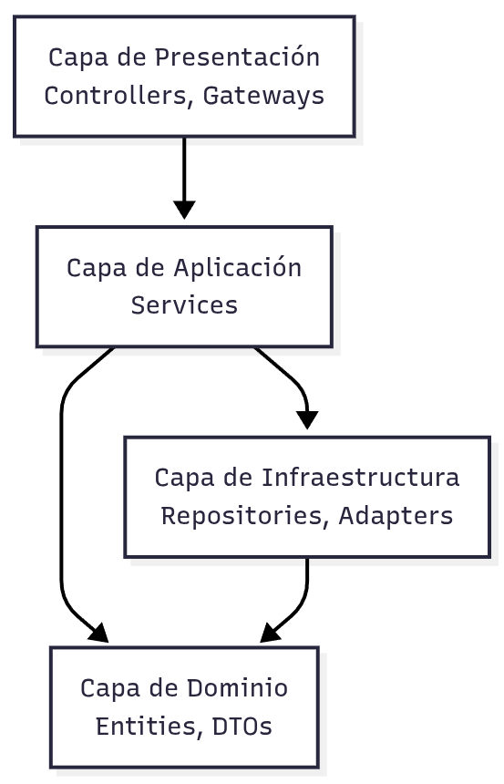
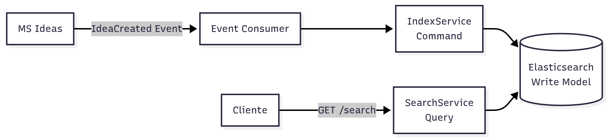
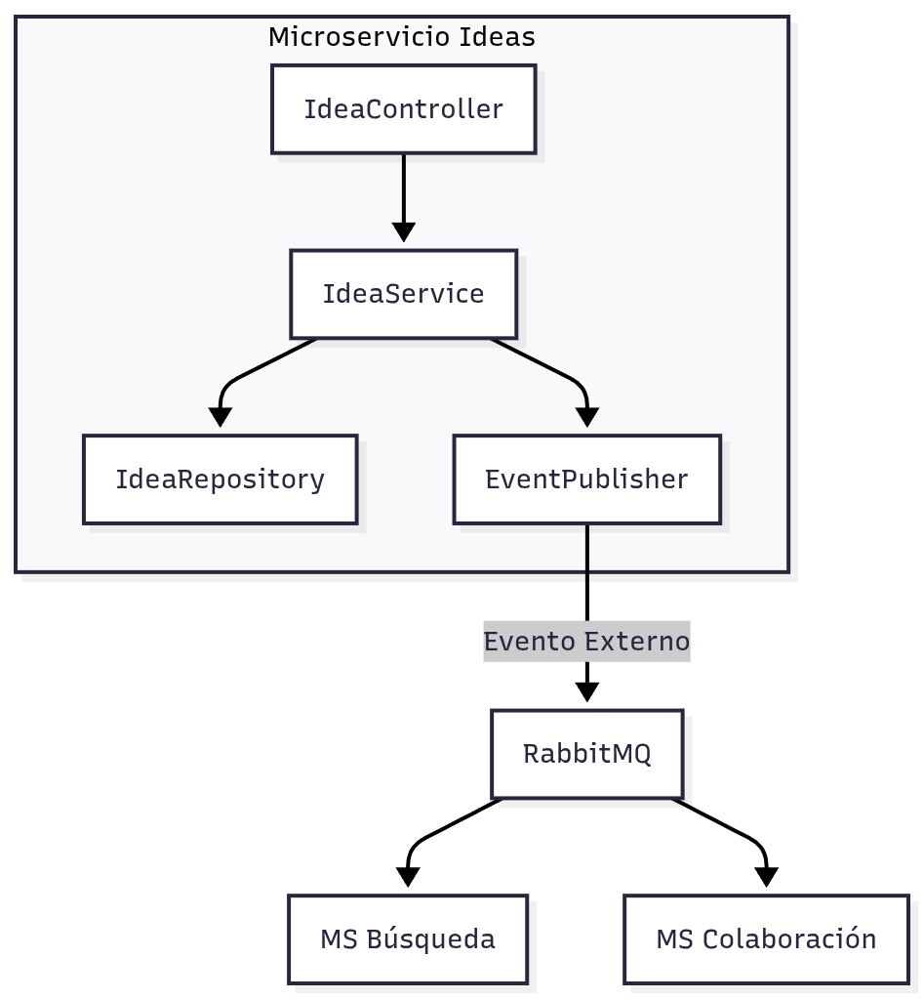

> [9. Metodología de Diseño de Arquitectura - Aplicación de ADD](../../9.md) › [9.3. Iteración 2: Identificar estructuras para soportar la funcionalidad primaria](../9.3.md) › [9.3.3. Conceptos de diseño](9.3.3.md)

# 9.3.3. Conceptos de diseño

## Conceptos de Diseño

Esta sección documenta los patrones y conceptos de diseño aplicados para descomponer los microservicios en componentes internos.

---

### 1. Patrón: Layered Architecture (Arquitectura en Capas)

#### Descripción

Organiza el código en capas horizontales, donde cada capa tiene una responsabilidad específica y solo puede depender de capas inferiores.

#### Capas Aplicadas en NEXUS



| Capa | Responsabilidad | Tecnología NestJS |
|---|---|---|
| **Presentación** | Manejo de peticiones HTTP/WebSocket | `@Controller()`, `@WebSocketGateway()` |
| **Aplicación** | Lógica de negocio y orquestación | `@Injectable()` Services |
| **Dominio** | Modelos y reglas de negocio | Classes, Interfaces, DTOs |
| **Infraestructura** | Acceso a datos y servicios externos | Repositories, Adapters con `@Injectable()` |

#### Beneficios

- **Separación de Responsabilidades**: Cada capa tiene un propósito claro
- **Testabilidad**: Capas pueden ser testeadas independientemente
- **Mantenibilidad**: Cambios en una capa no afectan otras (ESC-06)
- **Reusabilidad**: Services pueden ser reutilizados por múltiples Controllers

---

### 2. Patrón: Repository Pattern

#### Descripción

Abstrae el acceso a datos mediante una interfaz, desacoplando la lógica de negocio de la tecnología de persistencia.

#### Implementación en NEXUS

```typescript
// Interfaz del repositorio
interface IUserRepository {
  findById(id: string): Promise<User>;
  findByEmail(email: string): Promise<User>;
  create(user: CreateUserDto): Promise<User>;
  update(id: string, data: UpdateUserDto): Promise<User>;
}

// Implementación para PostgreSQL
@Injectable()
class UserRepository implements IUserRepository {
  constructor(@InjectRepository(User) private repo: Repository<User>) {}
  
  async findById(id: string): Promise<User> {
    return this.repo.findOne({ where: { id } });
  }
  // ...
}
```

#### Beneficios

- **Abstracción**: Services no conocen detalles de la BD
- **Testabilidad**: Fácil crear mocks de repositorios
- **Cambio de BD**: Cambiar implementación sin afectar Services

---

### 3. Patrón: Adapter Pattern (Hexagonal Architecture)

#### Descripción

Encapsula la integración con servicios externos mediante adaptadores, permitiendo cambiar proveedores sin afectar la lógica de negocio.

#### Adaptadores en NEXUS


**Ejemplo de Adaptador**:

```typescript
// Interfaz
interface IEmailAdapter {
  sendWelcomeEmail(to: string, name: string): Promise<void>;
}

// Implementación SendGrid
@Injectable()
class SendGridAdapter implements IEmailAdapter {
  async sendWelcomeEmail(to: string, name: string): Promise<void> {
    await this.sendgridClient.send({
      to, from: 'noreply@nexus.com',
      templateId: 'welcome-template',
      dynamicTemplateData: { name }
    });
  }
}
```

#### Adaptadores Implementados

| Adaptador | Servicio Externo | Microservicios que lo usan |
|---|---|---|
| **SendGridAdapter** | SendGrid API | Perfil |
| **S3Adapter** | AWS S3 | Ideas, Colaboración |
| **StripeAdapter** | Stripe API | Pagos |
| **ExpoPushAdapter** | Expo Push Notifications | Colaboración |
| **ElasticsearchAdapter** | Elasticsearch | Búsqueda |
| **RedisAdapter** | Redis Pub/Sub | Colaboración |

---

### 4. Patrón: Dependency Injection (DI)

#### Descripción

NestJS utiliza inyección de dependencias para gestionar la creación y ciclo de vida de componentes.

#### Implementación

```typescript
@Injectable()
export class ChatService {
  constructor(
    private readonly messageRepo: MessageRepository,
    private readonly roomRepo: RoomRepository,
    private readonly redisAdapter: RedisAdapter,
    private readonly eventPublisher: EventPublisher
  ) {}
  
  async sendMessage(roomId: string, userId: string, content: string) {
    const message = await this.messageRepo.create({ roomId, userId, content });
    await this.redisAdapter.publish('message:new', message);
    await this.eventPublisher.publish('MessageSent', message);
    return message;
  }
}
```

#### Beneficios

- **Bajo Acoplamiento**: Componentes no crean sus dependencias
- **Testabilidad**: Fácil inyectar mocks en tests
- **Configuración Centralizada**: NestJS gestiona el ciclo de vida

---

### 5. Patrón: DTO (Data Transfer Object)

#### Descripción

Objetos que transportan datos entre capas, con validación automática.

#### Implementación con Class-Validator

```typescript
export class CreateIdeaDto {
  @IsString()
  @MinLength(10)
  @MaxLength(100)
  title: string;

  @IsString()
  @MinLength(50)
  description: string;

  @IsEnum(IdeaCategory)
  category: IdeaCategory;

  @IsArray()
  @IsString({ each: true })
  tags: string[];
}
```

#### Beneficios

- **Validación Automática**: NestJS valida DTOs con `ValidationPipe`
- **Documentación**: DTOs documentan la estructura de datos
- **Type Safety**: TypeScript garantiza tipos correctos

---

### 6. Patrón: CQRS (Command Query Responsibility Segregation)

#### Descripción

Separa operaciones de lectura (Queries) de operaciones de escritura (Commands). Aplicado parcialmente en el Microservicio de Búsqueda.

#### Implementación en MS Búsqueda



**Escritura (Command)**:
- `IndexService` escucha eventos y actualiza Elasticsearch
- Optimizado para escritura rápida

**Lectura (Query)**:
- `SearchService` consulta Elasticsearch
- Optimizado para búsquedas complejas

#### Beneficios

- **Escalabilidad**: Escalar lectura y escritura independientemente
- **Optimización**: Modelos diferentes para lectura y escritura
- **Eventual Consistency**: Aceptable para búsqueda

---

### 7. Patrón: Event-Driven Communication (Interna)

#### Descripción

Componentes se comunican mediante eventos internos y externos.

#### Eventos Internos vs Externos



**Eventos Externos** (via RabbitMQ):
- `IdeaCreated`, `MessageSent`, `PaymentCompleted`
- Comunicación entre microservicios

**Eventos Internos** (NestJS EventEmitter):
- Comunicación dentro del mismo microservicio
- Ejemplo: `UserCreated` → enviar email de bienvenida

---

### 8. Patrón: Middleware y Guards (NestJS)

#### Descripción

Interceptan peticiones para validación, autenticación y logging.

#### Guards Implementados

```typescript
@Injectable()
export class JwtAuthGuard extends AuthGuard('jwt') {
  canActivate(context: ExecutionContext) {
    return super.canActivate(context);
  }
}

@Injectable()
export class RolesGuard implements CanActivate {
  canActivate(context: ExecutionContext): boolean {
    const requiredRoles = this.reflector.get('roles', context.getHandler());
    const { user } = context.switchToHttp().getRequest();
    return requiredRoles.some(role => user.roles.includes(role));
  }
}
```

**Uso en Controllers**:

```typescript
@Controller('admin')
@UseGuards(JwtAuthGuard, RolesGuard)
export class AdminController {
  @Get('users')
  @Roles('admin')
  async getUsers() { /* ... */ }
}
```

---

### 9. Patrón: WebSocket Gateway (Socket.IO)

#### Descripción

Manejo de conexiones WebSocket para comunicación en tiempo real.

#### Implementación en MS Colaboración

```typescript
@WebSocketGateway({ namespace: '/chat' })
export class ChatGateway {
  @WebSocketServer() server: Server;
  
  constructor(
    private chatService: ChatService,
    private redisAdapter: RedisAdapter
  ) {}
  
  @SubscribeMessage('message:send')
  async handleMessage(client: Socket, payload: SendMessageDto) {
    const message = await this.chatService.sendMessage(payload);
    this.server.to(payload.roomId).emit('message:receive', message);
  }
  
  @SubscribeMessage('user:typing')
  handleTyping(client: Socket, payload: { roomId: string }) {
    client.to(payload.roomId).emit('user:typing', { userId: client.data.userId });
  }
}
```

---

### Resumen de Patrones Aplicados

| Patrón | Microservicios | Beneficio Principal |
|---|---|---|
| **Layered Architecture** | Todos | Separación de responsabilidades |
| **Repository** | Perfil, Colaboración, Pagos | Abstracción de persistencia |
| **Adapter** | Todos | Desacoplamiento de servicios externos |
| **Dependency Injection** | Todos | Testabilidad y bajo acoplamiento |
| **DTO** | Todos | Validación automática |
| **CQRS** | Búsqueda | Optimización lectura/escritura |
| **Event-Driven** | Todos | Comunicación desacoplada |
| **Guards** | Todos | Autenticación y autorización |
| **WebSocket Gateway** | Colaboración | Comunicación en tiempo real |

---

[⬅️ Anterior](../9.3.2/9.3.2.md) | [🏠 Home](../../../README.md) | [Siguiente ➡️](../9.3.4/9.3.4.md)