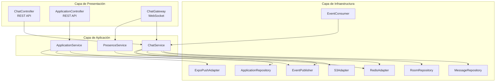

> [9. Metodología de Diseño de Arquitectura - Aplicación de ADD](../../9.md) › [9.3. Iteración 2: Identificar estructuras para soportar la funcionalidad primaria](../9.3.md) › [9.3.4. Elementos instanciados](9.3.4.md)

# 9.3.4. Elementos instanciados

## Elementos Instanciados

Esta sección presenta los componentes concretos instanciados en cada microservicio. Para detalles completos, consultar la [Sección 6.3 - Diagrama de Componentes](../../../6/6.3/6.3.md).

---

### Resumen de Componentes por Microservicio

| Microservicio | Controllers | Services | Repositories | Adapters | Otros |
|---|---|---|---|---|---|
| **Perfil** | 3 | 3 | 1 | 3 | 1 EventPublisher |
| **Ideas** | 3 | 3 | 2 | 2 | 1 EventPublisher |
| **Búsqueda** | 1 | 3 | 0 | 1 | 2 (QueryBuilder, EventConsumer) |
| **Colaboración** | 2 | 3 | 3 | 3 | 3 (Gateway, EventPublisher, EventConsumer) |
| **Pagos** | 3 | 3 | 2 | 1 | 1 EventPublisher |

**Total de componentes instanciados**: **52 componentes**

---

### Microservicio de Colaboración (Detalle Completo)

Por su relevancia en los atributos de calidad, se detalla completamente el MS Colaboración:



#### Componentes del MS Colaboración

**Controllers**:
- `ChatController`: Endpoints REST para salas y mensajes (`GET /chat/rooms`, `POST /chat/rooms`, `GET /chat/rooms/:id/messages`)
- `ApplicationController`: Endpoints de postulaciones (`POST /applications`, `PUT /applications/:id/accept`)

**Gateway**:
- `ChatGateway`: Maneja conexiones WebSocket, eventos `message:send`, `message:receive`, `user:typing`, `user:online`

**Services**:
- `ChatService`: Lógica de salas y mensajes, orquesta repositorios y adaptadores
- `ApplicationService`: Lógica de postulaciones a proyectos
- `PresenceService`: Gestión de usuarios conectados/desconectados

**Repositories**:
- `MessageRepository`: CRUD de mensajes en PostgreSQL
- `RoomRepository`: CRUD de salas en PostgreSQL
- `ApplicationRepository`: CRUD de postulaciones en PostgreSQL

**Adapters**:
- `RedisAdapter`: Pub/Sub para sincronización entre instancias de Socket.IO
- `S3Adapter`: Subida de archivos adjuntos en mensajes
- `ExpoPushAdapter`: Envío de notificaciones push cuando usuario offline

**Event Handlers**:
- `EventPublisher`: Publica `MessageSent`, `ApplicationSubmitted` a RabbitMQ
- `EventConsumer`: Consume `IdeaCreated` para crear sala automáticamente

---

### Mapeo de Casos de Uso a Componentes

#### CU06: Enviar mensaje en una sala

| Paso | Componente | Acción |
|---|---|---|
| 1 | `ChatGateway` | Recibe evento `message:send` via WebSocket |
| 2 | `ChatService` | Valida permisos, crea mensaje |
| 3 | `MessageRepository` | Persiste mensaje en PostgreSQL |
| 4 | `RedisAdapter` | Publica mensaje a otras instancias |
| 5 | `EventPublisher` | Publica evento `MessageSent` a RabbitMQ |
| 6 | `ChatGateway` | Emite `message:receive` a todos los clientes de la sala |

#### CU07: Recibir mensajes en tiempo real

| Paso | Componente | Acción |
|---|---|---|
| 1 | Cliente | Conecta WebSocket y se une a sala |
| 2 | `ChatGateway` | Registra cliente en sala de Socket.IO |
| 3 | `PresenceService` | Marca usuario como online en Redis |
| 4 | `ChatGateway` | Escucha eventos de `RedisAdapter` |
| 5 | `ChatGateway` | Emite mensajes recibidos a cliente |

#### CU08: Crear/unirse a sala de colaboración

| Paso | Componente | Acción |
|---|---|---|
| 1 | `ChatController` | Recibe `POST /chat/rooms` |
| 2 | `ChatService` | Valida datos, crea sala |
| 3 | `RoomRepository` | Persiste sala en PostgreSQL |
| 4 | `ChatService` | Retorna ID de sala creada |

#### CU09: Ver participantes y estados

| Paso | Componente | Acción |
|---|---|---|
| 1 | `ChatController` | Recibe `GET /chat/rooms/:id/participants` |
| 2 | `ChatService` | Consulta participantes de sala |
| 3 | `PresenceService` | Consulta estados de conexión en Redis |
| 4 | `ChatService` | Combina datos y retorna lista |

---

### Interfaces Clave

#### Interface: IMessageRepository

```typescript
interface IMessageRepository {
  create(data: CreateMessageDto): Promise<Message>;
  findByRoom(roomId: string, limit: number, offset: number): Promise<Message[]>;
  markAsRead(messageId: string, userId: string): Promise<void>;
}
```

#### Interface: IRedisAdapter

```typescript
interface IRedisAdapter {
  publish(channel: string, message: any): Promise<void>;
  subscribe(channel: string, handler: (message: any) => void): void;
  setPresence(userId: string, status: 'online' | 'offline'): Promise<void>;
  getPresence(userId: string): Promise<'online' | 'offline'>;
}
```

#### Interface: IEventPublisher

```typescript
interface IEventPublisher {
  publish(eventName: string, payload: any): Promise<void>;
}
```

---

### Modelo de Datos - MS Colaboración

#### Tabla: Messages

| Campo | Tipo | Descripción |
|---|---|---|
| id | UUID | Primary Key |
| roomId | UUID | Foreign Key → Rooms |
| userId | UUID | ID del autor |
| content | TEXT | Contenido del mensaje |
| attachmentUrl | VARCHAR | URL de archivo adjunto (S3) |
| createdAt | TIMESTAMP | Fecha de creación |
| readBy | JSON | Array de userIds que leyeron |

#### Tabla: Rooms

| Campo | Tipo | Descripción |
|---|---|---|
| id | UUID | Primary Key |
| ideaId | UUID | ID de la idea asociada |
| name | VARCHAR | Nombre de la sala |
| type | ENUM | 'public', 'private' |
| createdBy | UUID | ID del creador |
| createdAt | TIMESTAMP | Fecha de creación |

#### Tabla: Applications

| Campo | Tipo | Descripción |
|---|---|---|
| id | UUID | Primary Key |
| projectId | UUID | ID del proyecto |
| userId | UUID | ID del postulante |
| message | TEXT | Mensaje de postulación |
| portfolioUrl | VARCHAR | URL de portafolio |
| status | ENUM | 'pending', 'accepted', 'rejected' |
| createdAt | TIMESTAMP | Fecha de postulación |

---

### Conclusión

Se han instanciado **52 componentes** distribuidos en los 5 microservicios, siguiendo patrones de diseño establecidos (Layered Architecture, Repository, Adapter, DI). Cada componente tiene una responsabilidad clara y está mapeado a casos de uso específicos.

---

[⬅️ Anterior](../9.3.3/9.3.3.md) | [🏠 Home](../../../README.md) | [Siguiente ➡️](../9.3.5/9.3.5.md)