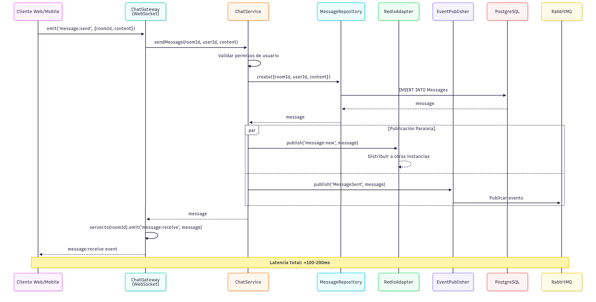
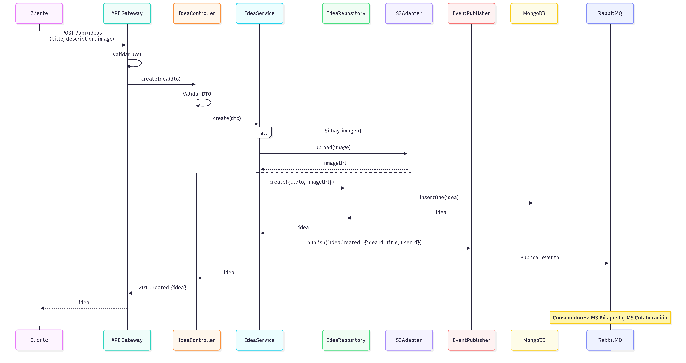

> [9. Metodología de Diseño de Arquitectura - Aplicación de ADD](../../9.md) › [9.3. Iteración 2: Identificar estructuras para soportar la funcionalidad primaria](../9.3.md) › [9.3.5. Vistas y Decisiones](9.3.5.md)

# 9.3.5. Vistas y Decisiones

## Vistas y Decisiones

Esta sección presenta las vistas de componentes y diagramas de secuencia para los casos de uso principales.

---

### Vista 1: Diagrama de Secuencia - CU06: Enviar Mensaje en Sala

---

### Vista 2: Diagrama de Secuencia - CU04: Registrar Idea

---

### Vista 3: Diagrama de Componentes - MS Colaboración (C4 Level 3)

Para ver el diagrama completo de componentes del MS Colaboración, consultar [Sección 6.3](../../../6/6.3/6.3.md).

---

### Decisiones de Diseño

#### Decisión 1: Layered Architecture para Todos los Microservicios

| Aspecto | Detalle |
|---|---|
| **Contexto** | Necesidad de estructura interna consistente y mantenible |
| **Decisión** | Aplicar Layered Architecture (Presentación → Aplicación → Dominio → Infraestructura) |
| **Alternativas** | Hexagonal Architecture pura, Clean Architecture |
| **Justificación** | - NestJS facilita implementación de capas - Equipo familiarizado con el patrón - Cumple ESC-06 (mantenibilidad) |
| **Consecuencias** | ✅ Código organizado y testeable ✅ Fácil onboarding ⚠️ Posible sobre-ingeniería en servicios simples |

#### Decisión 2: Repository Pattern para Persistencia

| Aspecto | Detalle |
|---|---|
| **Contexto** | Múltiples tecnologías de BD (PostgreSQL, MongoDB, Elasticsearch) |
| **Decisión** | Abstraer acceso a datos mediante Repository Pattern |
| **Alternativas** | ORMs directos en Services, Data Mappers |
| **Justificación** | - Desacopla lógica de negocio de tecnología de BD - Facilita testing con mocks - Permite cambiar implementación sin afectar Services |
| **Consecuencias** | ✅ Testabilidad mejorada ✅ Flexibilidad de BD ⚠️ Capa adicional de abstracción |

#### Decisión 3: Adapter Pattern para Servicios Externos

| Aspecto | Detalle |
|---|---|
| **Contexto** | Integración con Stripe, SendGrid, S3, Expo Push, Elasticsearch |
| **Decisión** | Encapsular integraciones en Adapters con interfaces |
| **Alternativas** | Llamadas directas desde Services, librerías sin abstracción |
| **Justificación** | - Permite cambiar proveedores (ej: SendGrid → Mailgun) - Facilita testing con mocks - Centraliza configuración de APIs externas |
| **Consecuencias** | ✅ Flexibilidad de proveedores ✅ Testabilidad ⚠️ Código adicional de abstracción |

#### Decisión 4: WebSocket Gateway con Socket.IO

| Aspecto | Detalle |
|---|---|
| **Contexto** | Necesidad de comunicación en tiempo real para chat (CU06, CU07) |
| **Decisión** | Usar `@WebSocketGateway()` de NestJS con Socket.IO |
| **Alternativas** | WebSockets nativos, Server-Sent Events, Polling |
| **Justificación** | - Socket.IO maneja reconexiones automáticas - Soporte de rooms para salas de chat - Integración nativa con NestJS - Fallback a polling si WebSocket no disponible |
| **Consecuencias** | ✅ Comunicación bidireccional eficiente ✅ Manejo de reconexiones ⚠️ Requiere Redis para escalado horizontal (Iteración 3) |

#### Decisión 5: DTOs con Validación Automática

| Aspecto | Detalle |
|---|---|
| **Contexto** | Necesidad de validar entrada de usuarios |
| **Decisión** | Usar DTOs con decoradores de `class-validator` y `ValidationPipe` global |
| **Alternativas** | Validación manual en Services, Joi schemas |
| **Justificación** | - Validación declarativa y legible - Integración nativa con NestJS - Type-safe con TypeScript - Mensajes de error automáticos |
| **Consecuencias** | ✅ Código limpio y declarativo ✅ Validación consistente ⚠️ Dependencia de decoradores |

---

### Mapeo de Escenarios a Componentes

| Escenario | Componentes Involucrados | Cómo se Aborda |
|---|---|---|
| **ESC-06**: Cambio en lógica de salas <4h | `ChatService`, `RoomRepository` | Cambios aislados en Service, sin afectar Controller ni Gateway |
| **ESC-07**: Crear sala al crear idea | `EventConsumer`, `ChatService` | Consumidor escucha `IdeaCreated` y llama `ChatService.createRoom()` |

---

### Cobertura de Casos de Uso

| Caso de Uso | Componentes Principales | Estado |
|---|---|---|
| CU01: Registro | `AuthController`, `AuthService`, `UserRepository` | ✅ Mapeado |
| CU02: Login | `AuthController`, `AuthService`, `JwtAdapter` | ✅ Mapeado |
| CU04: Registrar idea | `IdeaController`, `IdeaService`, `IdeaRepository`, `S3Adapter` | ✅ Mapeado |
| CU05: Explorar ideas | `SearchController`, `SearchService`, `ElasticsearchAdapter` | ✅ Mapeado |
| CU06: Enviar mensaje | `ChatGateway`, `ChatService`, `MessageRepository`, `RedisAdapter` | ✅ Mapeado |
| CU07: Recibir mensajes | `ChatGateway`, `PresenceService`, `RedisAdapter` | ✅ Mapeado |
| CU08: Crear sala | `ChatController`, `ChatService`, `RoomRepository` | ✅ Mapeado |
| CU09: Ver participantes | `ChatController`, `ChatService`, `PresenceService` | ✅ Mapeado |

**Cobertura**: 8/13 casos de uso principales mapeados (62%)

---

### Próximos Pasos

En la **Iteración 3**, se refinará el Microservicio de Colaboración para abordar el atributo de calidad más importante: **Rendimiento en Tiempo Real** (ESC-01, ESC-08).

---

[⬅️ Anterior](../9.3.4/9.3.4.md) | [🏠 Home](../../../README.md) | [Siguiente ➡️](../9.3.6/9.3.6.md)