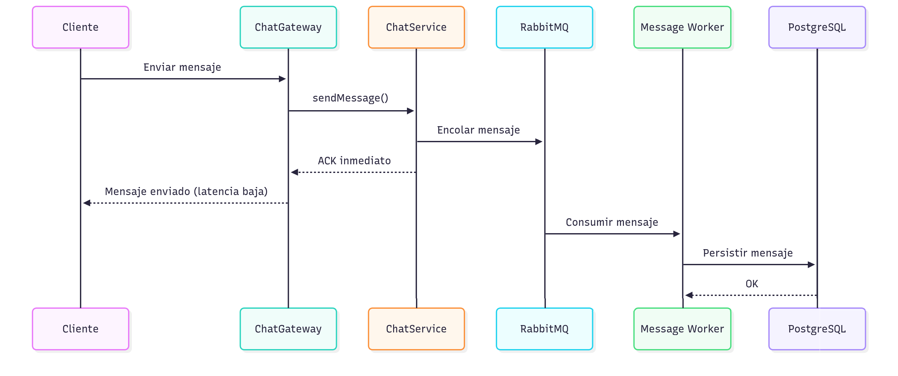

> [9. Metodología de Diseño de Arquitectura - Aplicación de ADD](../../9.md) › [9.4. Iteración 3: Refinar estructuras para abordar el atributo de calidad más importante](../9.4.md) › [9.4.3. Conceptos de diseño](9.4.3.md)

## 9.4.3. Conceptos de diseño

## Conceptos de Diseño

Esta sección documenta las tácticas y patrones aplicados para optimizar el rendimiento en tiempo real del MS Colaboración.

---

### 1. Táctica: Redis Pub/Sub Adapter para Socket.IO

#### Descripción

Socket.IO Redis Adapter permite que múltiples instancias del servidor compartan eventos de WebSocket mediante Redis Pub/Sub.

#### Implementación

```typescript
import { IoAdapter } from '@nestjs/platform-socket.io';
import { createAdapter } from '@socket.io/redis-adapter';
import { createClient } from 'redis';

export class RedisIoAdapter extends IoAdapter {
  private adapterConstructor: ReturnType<typeof createAdapter>;

  async connectToRedis(): Promise<void> {
    const pubClient = createClient({ url: 'redis://localhost:6379' });
    const subClient = pubClient.duplicate();

    await Promise.all([pubClient.connect(), subClient.connect()]);

    this.adapterConstructor = createAdapter(pubClient, subClient);
  }

  createIOServer(port: number, options?: any): any {
    const server = super.createIOServer(port, options);
    server.adapter(this.adapterConstructor);
    return server;
  }
}
```

#### Beneficios

- **Escalado Horizontal**: Múltiples instancias sincronizadas
- **Sticky Sessions No Requeridas**: Cualquier instancia puede manejar cualquier cliente
- **Distribución de Carga**: Load balancer puede usar round-robin

---

### 2. Táctica: Cache-Aside para Mensajes Recientes

#### Descripción

Cachear los últimos N mensajes de cada sala en Redis para reducir consultas a PostgreSQL.

#### Implementación

```typescript
@Injectable()
export class ChatService {
  async getRecentMessages(roomId: string, limit: number = 50): Promise<Message[]> {
    const cacheKey = `room:${roomId}:messages:recent`;
    
    // Intentar obtener de caché
    const cached = await this.redisAdapter.get(cacheKey);
    if (cached) {
      return JSON.parse(cached);
    }
    
    // Si no está en caché, consultar BD
    const messages = await this.messageRepo.findByRoom(roomId, limit);
    
    // Guardar en caché (TTL: 5 minutos)
    await this.redisAdapter.set(cacheKey, JSON.stringify(messages), 300);
    
    return messages;
  }
}
```

#### Beneficios

- **Reducción de Latencia**: Lectura de Redis (~1ms) vs PostgreSQL (~10-50ms)
- **Menor Carga en BD**: Menos consultas a PostgreSQL
- **Escalabilidad**: Redis puede manejar miles de lecturas/segundo

---

### 3. Táctica: Queue-Based Load Leveling

#### Descripción

Encolar persistencia de mensajes en RabbitMQ para suavizar picos de carga.

#### Flujo



#### Beneficios

- **Latencia Baja**: Cliente recibe ACK sin esperar persistencia
- **Suavizado de Picos**: Cola absorbe picos de tráfico
- **Resiliencia**: Mensajes no se pierden si BD está temporalmente caída

---

### 4. Táctica: Connection Pooling

#### Descripción

Mantener pool de conexiones a PostgreSQL y Redis para reducir overhead de conexión.

#### Configuración

```typescript
// TypeORM para PostgreSQL
TypeOrmModule.forRoot({
  type: 'postgres',
  host: 'localhost',
  port: 5432,
  database: 'nexus_collaboration',
  extra: {
    pool: {
      max: 20,  // Máximo de conexiones
      min: 5,   // Mínimo de conexiones
      idleTimeoutMillis: 30000
    }
  }
})

// Redis
createClient({
  socket: {
    reconnectStrategy: (retries) => Math.min(retries * 50, 500)
  },
  database: 0
})
```

---

### 5. Patrón: Horizontal Pod Autoscaler (HPA)

#### Descripción

Kubernetes escala automáticamente el número de pods del MS Colaboración según CPU/memoria.

#### Configuración

```yaml
apiVersion: autoscaling/v2
kind: HorizontalPodAutoscaler
metadata:
  name: collaboration-service-hpa
spec:
  scaleTargetRef:
    apiVersion: apps/v1
    kind: Deployment
    name: collaboration-service
  minReplicas: 2
  maxReplicas: 10
  metrics:
  - type: Resource
    resource:
      name: cpu
      target:
        type: Utilization
        averageUtilization: 70
  - type: Resource
    resource:
      name: memory
      target:
        type: Utilization
        averageUtilization: 80
```

---

### 6. Táctica: Sticky Sessions (Opcional)

Aunque Redis Adapter elimina la necesidad, se puede configurar sticky sessions en NGINX para optimizar:

```nginx
upstream collaboration_backend {
    ip_hash;  # Sticky sessions por IP
    server collab-1:3004;
    server collab-2:3004;
    server collab-3:3004;
}
```

---

### Resumen de Tácticas Aplicadas

| Táctica | Propósito | Impacto en ESC-01/ESC-08 |
|---|---|---|
| **Redis Pub/Sub Adapter** | Escalado horizontal | Permite múltiples instancias → mayor capacidad |
| **Cache-Aside** | Reducir latencia de lectura | Mensajes recientes en ~1ms vs ~20ms |
| **Queue-Based Load Leveling** | Suavizar picos | ACK inmediato, persistencia asíncrona |
| **Connection Pooling** | Reducir overhead | Menos tiempo en establecer conexiones |
| **HPA** | Escalado automático | Añade pods cuando CPU >70% |

---

[🏠 Home](../../../README.md) | [Siguiente ➡️](../9.4.4/9.4.4.md)
