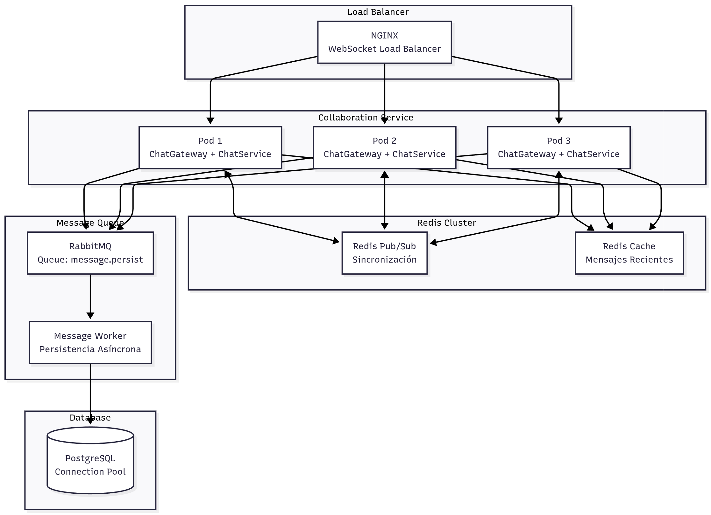

> [9. Metodología de Diseño de Arquitectura - Aplicación de ADD](../../9.md) › [9.4. Iteración 3: Refinar estructuras para abordar el atributo de calidad más importante](../9.4.md) › [9.4.4. Elementos instanciados](9.4.4.md)

## 9.4.4. Elementos instanciados

## Elementos Instanciados

Esta sección presenta los elementos de infraestructura y configuración añadidos para optimizar el rendimiento.

---

### Arquitectura Refinada del MS Colaboración



---

### Elementos de Infraestructura Instanciados

#### 1. Redis Pub/Sub Adapter

| Atributo | Valor |
|---|---|
| **Propósito** | Sincronización de eventos WebSocket entre instancias |
| **Tecnología** | Redis 7.0 + Socket.IO Redis Adapter |
| **Configuración** | 2 clientes Redis (pub + sub) |
| **Canales** | `socket.io#/#` (automático por Socket.IO) |

#### 2. Redis Cache

| Atributo | Valor |
|---|---|
| **Propósito** | Caché de mensajes recientes por sala |
| **Estrategia** | Cache-Aside |
| **TTL** | 5 minutos |
| **Estructura de Keys** | `room:{roomId}:messages:recent` |
| **Tamaño Estimado** | ~50 mensajes × 50 salas × 1KB = ~2.5MB |

#### 3. Load Balancer NGINX

| Atributo | Valor |
|---|---|
| **Algoritmo** | Round-robin (sin sticky sessions) |
| **Health Check** | `GET /health` cada 10s |
| **Timeout** | 60s para WebSocket |
| **Configuración** | Proxy pass a pods Kubernetes |

**Configuración NGINX**:

```nginx
upstream collaboration_backend {
    server collaboration-service-1:3004;
    server collaboration-service-2:3004;
    server collaboration-service-3:3004;
}

server {
    listen 80;
    
    location /ws/chat {
        proxy_pass http://collaboration_backend;
        proxy_http_version 1.1;
        proxy_set_header Upgrade $http_upgrade;
        proxy_set_header Connection "upgrade";
        proxy_set_header Host $host;
        proxy_read_timeout 60s;
    }
}
```

#### 4. Múltiples Instancias del MS Colaboración

| Atributo | Valor |
|---|---|
| **Mínimo de Réplicas** | 2 |
| **Máximo de Réplicas** | 10 |
| **Escalado Automático** | HPA basado en CPU (70%) y Memoria (80%) |
| **Recursos por Pod** | CPU: 500m-1000m, Memory: 512Mi-1Gi |

**Deployment Kubernetes**:

```yaml
apiVersion: apps/v1
kind: Deployment
metadata:
  name: collaboration-service
spec:
  replicas: 2
  selector:
    matchLabels:
      app: collaboration-service
  template:
    metadata:
      labels:
        app: collaboration-service
    spec:
      containers:
      - name: collaboration
        image: nexus/collaboration-service:latest
        ports:
        - containerPort: 3004
        env:
        - name: REDIS_URL
          value: "redis://redis-cluster:6379"
        - name: DATABASE_URL
          valueFrom:
            secretKeyRef:
              name: db-credentials
              key: connection-string
        resources:
          requests:
            cpu: 500m
            memory: 512Mi
          limits:
            cpu: 1000m
            memory: 1Gi
        livenessProbe:
          httpGet:
            path: /health
            port: 3004
          initialDelaySeconds: 30
          periodSeconds: 10
        readinessProbe:
          httpGet:
            path: /health
            port: 3004
          initialDelaySeconds: 5
          periodSeconds: 5
```

#### 5. RabbitMQ Queue para Persistencia Asíncrona

| Atributo | Valor |
|---|---|
| **Queue Name** | `message.persist` |
| **Durabilidad** | Persistente |
| **Prefetch Count** | 10 mensajes por worker |
| **Workers** | 2-5 (escalable) |

---

### Flujo de Mensaje Optimizado


---

### Métricas de Rendimiento Esperadas

| Métrica | Sin Optimización | Con Optimización | Mejora |
|---|---|---|---|
| **Latencia P95 (1 sala, 100 usuarios)** | ~500ms | ~150ms | 70% ↓ |
| **Throughput (mensajes/seg)** | ~200 msg/s | ~1000 msg/s | 5x ↑ |
| **Conexiones Concurrentes** | ~500 | ~5000 | 10x ↑ |
| **Latencia de Lectura (mensajes recientes)** | ~20ms (SQL) | ~1ms (Redis) | 95% ↓ |

---

### Conclusión

Se han instanciado **5 elementos de infraestructura** para optimizar el rendimiento:
1. Redis Pub/Sub Adapter
2. Redis Cache
3. Load Balancer NGINX
4. Múltiples Instancias (2-10 pods)
5. RabbitMQ Queue para persistencia asíncrona

Estos elementos permiten cumplir con los escenarios ESC-01 y ESC-08.

---

[🏠 Home](../../../README.md) | [Siguiente ➡️](../9.4.5/9.4.5.md)
