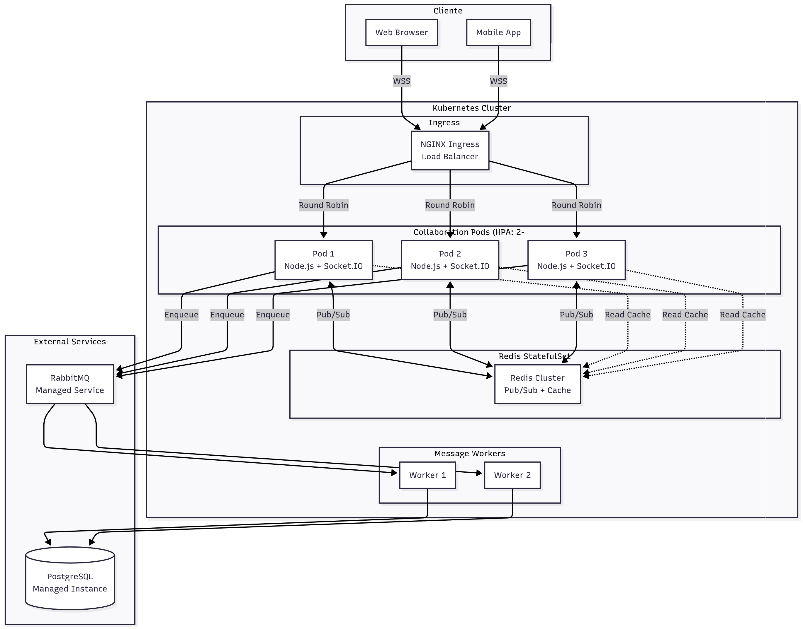

> [9. Metodología de Diseño de Arquitectura - Aplicación de ADD](../../9.md) › [9.4. Iteración 3: Refinar estructuras para abordar el atributo de calidad más importante](../9.4.md) › [9.4.5. Vistas y Decisiones](9.4.5.md)

## 9.4.5. Vistas y decisiones

## Vistas y Decisiones

Esta sección presenta las vistas de despliegue optimizadas y las decisiones tomadas para rendimiento.

---

### Vista 1: Diagrama de Despliegue Detallado - MS Colaboración

---

### Vista 2: Análisis de Rendimiento - ESC-01

---

### Vista 3: Análisis de Escalabilidad - ESC-08

---

### Decisiones de Diseño

---

### Próximos Pasos

En **Iteraciones Adicionales** (Sección 9.5), se abordarán otros atributos de calidad:
- Seguridad (ESC-03, ESC-04)
- Disponibilidad (ESC-02, ESC-09)
- Usabilidad (ESC-05)

---

[🏠 Home](../../../README.md) | [Siguiente ➡️](../9.4.6/9.4.6.md)
